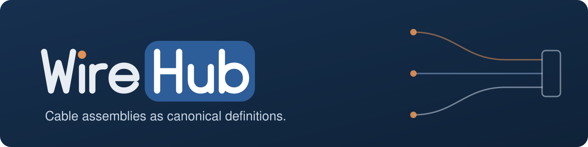

<p align="center">
  
</p>

# WireHub

WireHub captures the cable assemblies you build as canonical definitions, and
derives everything else from them: wiring schematics, build sheets, BOMs,
continuity test specs, drawings and wire specs.

- **A hierarchical wire model.** A stock is a tree: cables hold pairs, coax and cores,
  which hold conductors, shields and insulation. Bonded screens, drains, pigtails and
  breakouts (moulds where some conductors pass through and others end) are modelled
  as they are built.
- **A connector library.** A connector is a physical body (DE-9 male, XLR3 female)
  composed with a pinout (RS-232, balanced audio). Reuse one body for many pinouts.
- **PCBAs as black boxes** with declared internal continuity, so a trace runs through a
  board without modelling its electronics.
- **Derived, deterministic output.** Nets and traces, a continuity spec, a BOM, a
  bench build sheet, an ELK-laid-out SVG schematic and an ANSI-A drawing sheet all come
  from the same JSON definition, byte for byte the same every time.
- **An editor.** A React canvas for the wiring, a parts library with 3D views, a new-cable
  wizard, versions, edit locks and an optional login.
- **Modules.** Domain vocabularies (video, audio, fieldbus …) and what only one shop needs
  (its ERP link, its numbering scheme, its own importers) plug in at build time through
  a small registry instead of living in the base.

## Run it

You need Docker and one file — no clone, no `.env`:

```
mkdir wirehub && cd wirehub
curl -fsSLO https://raw.githubusercontent.com/formless63/wirehub/main/compose.yaml
docker compose up -d
docker compose logs wirehub        # the first-run setup code
```

Open <http://localhost:5183/setup> and enter the setup code. In a Docker UI
(Portainer, Komodo, Dockhand …), paste
[`compose.yaml`](https://raw.githubusercontent.com/formless63/wirehub/main/compose.yaml)
as a stack, deploy, and read the code from the `wirehub` container's logs.

On first start a one-shot `bootstrap` service generates every secret the stack
needs into a `secrets` volume and keeps it there. The few install choices — the
public URL, ports, backups (`COMPOSE_PROFILES=backup`), your own PostgreSQL or
S3 — go in an optional `.env`;
[`.env.example`](https://raw.githubusercontent.com/formless63/wirehub/main/.env.example)
explains each. Everything else — single sign-on, magic links, allowed emails,
alerts, the git mirror, job settings — is set in the app under **Settings** and
applies without a redeploy.

**Config generator: <https://formless63.github.io/wirehub/>** — pick your
options and get a ready `compose.yaml` and `.env`. It runs entirely in your
browser and sends nothing anywhere.

> The first release, v0.1.0, ships with the Postgres backend; until then the
> image is not published and you build it yourself (`docs/self-hosting.md`,
> "Development").

**First-run setup** lists the bundled domain modules whose signals, connectors
and example cables you can add — **PC & serial** (RS-232, RS-485, USB),
**Networking** (RJ45, T568A/B), **Pro audio** (XLR, TRS, RCA), **AV / video** and
**Automotive** — all unticked unless the deployment suggests some. Nothing is
required, and more can be enabled later from the command palette. The base
itself stays generic: its starter catalog holds wire stocks, generic connectors
(DE-9 by pin number, JST XH, terminal blocks), parts and a few neutral example
cables.

The stack is the app, PostgreSQL 18 and [Garage](https://garagehq.deuxfleurs.fr/)
(S3-compatible storage for uploaded files), plus restic backups through
Backrest as an optional profile. `docs/self-hosting.md` has the details.

## Develop

From source (Node 24+, pnpm 10 — `corepack enable`):

```
git clone https://github.com/formless63/wirehub && cd wirehub
pnpm install
pnpm --filter studio dev        # open the printed URL
```

The hub opens on the generic starter catalog: a few example cables built from a
small library of generic parts, every value cited to a public standard or marked
as a synthetic example. The catalog is plain JSON under `packages/catalog/data`,
and saves go straight back to it; domain modules enabled at setup install their
packs into the gitignored `data/packs/`, so they never land in a commit to the
base.

```
pnpm build                      # tsc --noEmit, strict, every package
pnpm test                       # vitest, each workspace in turn
pnpm --filter @wirehub/model test -- test/trace.test.ts
bash scripts/privacy-check.sh --tree
```

`pnpm install` also enables git hooks that keep home paths, secrets and personal
emails out of commits (`CONTRIBUTING.md`).

| Package | |
| --- | --- |
| `@wirehub/model` | the canonical model: types, validation, nets, trace, part-number schemes. Zero dependencies. |
| `@wirehub/catalog` | the file-backed catalog and the starter data. Zero dependencies. |
| `@wirehub/modules` | the module API and build-time registry. Zero dependencies, MIT. |
| `@wirehub/layout` | ELK layout of a design |
| `@wirehub/render-svg` | deterministic SVG schematics and cross-sections |
| `@wirehub/docs` | build sheet, BOM, continuity spec, drawing, wire spec |
| `@wirehub/editor-react` | the editor |
| `apps/studio` | the app: Vite SPA and Hono server; `stack/` the compose stack's one-shots |
| `site` | the config generator, published to GitHub Pages |
| `modules/*` | bundled modules: optional domain modules (`pc-serial`, `networking`, `pro-audio`, `av-video`, `automotive`) and the always-on interop modules `wireviz` (WireViz YAML in and out) and `csv-library` (bulk CSV library import) |

## Read next

- `SPEC.md` — the model and the plan; the single source of truth.
- `docs/modules.md` — extension points, domain modules, and how a private module lives
  in its own repository.
- `docs/exports.md` — CSV/XLSX exports, the continuity tester export, wire labels, and rendering documents without a browser.
- `docs/interop.md` — WireViz YAML import and export, bulk CSV library import, and part costing.
- `docs/catalog-store.md` — catalog packs: format, provenance, install and update.
- `docs/self-hosting.md` — install, the compose stack, secrets, storage, backups, development.
- `specs/postgres-backend.md` — the database backend (Phase A built).
- `docs/boundaries.md` — what this base was split from, and what it left out.

## Licence

WireHub is free software under the **GNU Affero General Public License v3.0 only**
(`LICENSE`), with one additional permission, the **WireHub Module Exception**
(`MODULE-EXCEPTION.md`). In plain language:

- **WireHub itself stays open.** If you modify WireHub and run it for others — including
  over a network — you offer them the source of your modified WireHub, under the AGPL.
- **Modules can use any licence.** A module that talks to WireHub only through the module
  API (`@wirehub/modules`, the model and catalog types) and the catalog-pack formats may
  be MIT, proprietary, or anything else. You can build and distribute a WireHub image that
  includes it without the module becoming AGPL, and without publishing its source.
- **`@wirehub/modules` is MIT**, so module authors can depend on it freely.
- **Catalog data is CC0-1.0.** The starter catalog (`packages/catalog/data`) and the
  bundled modules' packs are dedicated to the public domain, so the facts in them can
  be reused anywhere. Other packs, and records in them, carry their own licence
  (`docs/catalog-store.md`).
- Third-party material keeps its own licence (`NOTICE`).

There are no per-file licence headers: `LICENSE`, `MODULE-EXCEPTION.md` and each
package's `license` field are the record (`SPDX: AGPL-3.0-only WITH
AdditionRef-WireHub-Module-Exception-1.0`, `packages/modules`: `MIT`; `packages/catalog`: `AGPL-3.0-only AND CC0-1.0`, the code and
its data; bundled modules: `MIT`, their packs `CC0-1.0`). This summary is
not legal advice; the licence texts govern.

Contributing: `CONTRIBUTING.md` · Security: `SECURITY.md` · Conduct: `CODE_OF_CONDUCT.md`
