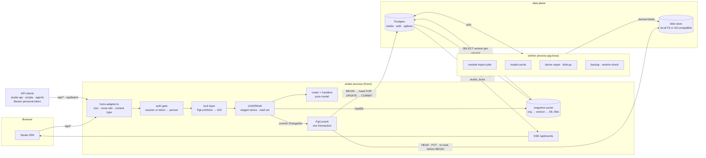

# Spec — Postgres backend, blob store, and the self-hosted install

Status: **plan**, rev 6.13 (rev 6 was the first revision in the open base). **Phases A
(schema and read path), B (write path, blobs, API clients), S (self-hosted install) and
C (worker and jobs) are built** (§11); D and E are plan. v0.1.0 shipped without the worker. The storage seam it plugs into is `storage-seam.md`. The execution
rules for agents building it are `postgres-backend-EXECUTION.md`.

## Changelog

- **rev 6.13** — Per-person UI preferences (cs-74m4). Migration **0024**: `studio.user_pref`, one JSON
  object per person (module slot pins, theme, table column choices), org-scoped under RLS, no audit
  trigger. Not a catalog table: no change set, history, export or git mirror reads it.
- **rev 6.12** — Module settings (cs-nws, module API 1.5). Migration **0023**: `studio.settings_secret.name`
  also admits `module.<module id>.<key>`, the secrets runtime modules declare (`specs/runtime-modules.md` §8).
  No new table: they share the store, its encryption, RLS and key rotation.
- **rev 6.11** — Part-number revision keys (cs-9ar). Migration **0022**: the `<part>` of
  `revisions/<part>/<revision>` also takes upper case (a part number).
- **rev 6.10** — Revision model links (cs-s97). Migration **0021**: `studio.model_link.record_key`
  also admits `revisions/<part>/<revision>`, the key of a part revision's own model.
- **rev 6.9** — Fonts as assets. Migration **0020**: `font/ttf`, `font/otf` and `font/woff2` join the
  allowed types of `studio.blob.media_type` and `studio.asset.mime` (a hub's licensed typeface uploaded
  in Settings, Branding; a data pack's `fonts/`). No new table.
- **rev 6.8** — Runtime settings (cs-gm8, `specs/runtime-settings.md`). Migration **0019**:
  `studio.settings_secret` — the secrets an owner enters in Settings (SMTP password, OIDC
  client secret, webhook URL and token, git mirror credentials), AES-256-GCM ciphertext under
  the install's `WIREHUB_SETTINGS_KEY`, org-scoped under RLS, no audit trigger. Not a catalog
  table: the change history, the export and the git mirror never read it.
- **rev 6.7** — Release approvals (cs-5k1.11). Migration **0018**: the locked-revision guard
  also allows an approval step (`approval` set, one `submit`/`approve`/`reject` history entry
  appended, nothing else changed). No new tables: the approval is part of the version file.
- **rev 6.6** — Change history (cs-5k1.4). Migration **0017**: `change.before_body` — each
  record's state before the change, as the commit read it before applying the set (JSON
  `null`: there was none; SQL NULL: not recorded — older rows, binary records, moves, and
  later changes of one record in the same set) — and the indexes a record's and the hub's
  history read by. A binary record's change keeps its metadata in `after_body` (an
  upload's mime and name; the bytes are the blob `after_etag` names). **History in the
  studio** (§3.5, "Change history"): `GET /api/history` (the change sets, filtered by
  person, date and kind), `GET /api/history/records/:subject`, `GET
  /api/history/entries/:id` and `POST /api/history/records/:subject/restore` — a restore
  is a new change set through the design and definition routes, never a rewrite. The
  file backend answers the same routes from the git log of its catalog. **A new queue,
  `git-mirror`** (opt-in, `WIREHUB_GIT_MIRROR_*`): every change set as a git commit by its
  person, replayed onto the mirror's tree through `commitChangeSet` (§2, "The worker
  process").
- **rev 6.5** — Phase C built. **Jobs have one shape on every backend** (`server/jobs/`):
  a `JobRun` kept by a store (memory on files, `studio.job_run`/`job_file` on pg) and run
  by a runner — in the studio process, one at a time, on the file backend (and on pg with
  `WIREHUB_WORKER=off`), or by the **worker** (`server/worker.ts`, `worker-run.ts`)
  through pg-boss on pg. Migration **0016**: schema `pgboss` (studio_app may create
  tables in it, not schemas; pg-boss runs with `createSchema: false`; the worker grants
  `studio_ro` read on its tables so `pg_dump` keeps working) and
  `studio.worker_heartbeat` (RLS). **The import job (§7.5):** the synchronous module import
  (`POST /api/modules/:module/_import/:importer`, `module-io.ts`) runs as a job with
  `job: true`; what it would write (`proposalOf`: new definitions and designs, never one that
  exists) goes through the very routes a person's edits would (`POST /api/definitions/…`,
  `POST /api/designs`) in one unit of work; the staged record changes (as JSON *text* in
  `job_run.result.plan` — a `jsonb` value would sort their keys, R1) are the plan, and their
  effect on the catalog files is `job_file`; `POST /api/jobs/:id/publish` is a request (409
  "changed since the import ran"), not a job. New routes: `GET/POST /api/jobs`,
  `GET /api/jobs/:id`, `POST /api/jobs/:id/publish`. **A new queue, `convert`:** a person's STEP upload converts in the
  worker (whose 1.5 GiB budget is sized for it) while the request waits — the upload's
  request and answer are unchanged; GLB/STL stay in the studio, and files convert
  everything in process as before. **`model-cache`** rebuilds every live key from its
  sources (`WIREHUB_MODEL_SOURCES`, plus the catalog's depiction art) through the same
  capped conversion, keys checked against `sourceKey`; `derived_blob` records `inputs`,
  `triangles`, `job_id`; the gate's `derived-blobs` check (`pg:gate --models`). **The
  `backup` queue is a watch, not a dump:** the backup profile (Phase S) makes the backups;
  the worker reads the read-only `backups` volume, marks `blob.backed_up_at` and alerts on
  a dump older than 30 h. GC deletes an orphan only after the snapshot marker
  (`WIREHUB_BACKUP_MARKER`, the deep check's; default `<backups>/.last-snapshot`) is newer
  than it (no marker: kept). `restore-check` stays `backup-dump`'s weekly job. Alerts go
  through the monitoring webhook (`server/notify.ts`, §8.6). The deep health check (§8.3)
  gains `worker`: the newest heartbeat older than five minutes fails it.
  `WIREHUB_STEP_RSS_LIMIT_MB` (1280 in the worker) keeps the child inside the cap. Not in
  C: module-registered queues (§3.13), the Backrest hook that touches the marker.
- **rev 6.4** — Phase S built. The compose stack runs `WIREHUB_BACKEND=pg`,
  `WIREHUB_ENV=prod` and sign-in on by default. **Setup mode (§9.1–9.2):** a database with
  no organisation answers 503 everywhere but `/api/setup`; `/setup`, with the setup code,
  creates the organisation, its catalog (starter or empty), the admin (owner, with an
  email + password account) and the chosen modules — as two change sets (the catalog
  import, then the modules through the ordinary setup), not one transaction; a failure
  before the catalog is in removes the org. The deps object is filled in place: no
  restart. **Adoption** replaces "copy the file deployment by hand": the migrate step's
  `cli.ts adopt` imports a file catalog that was in use (setup completed, or different from
  the image's pristine starter at `/app/starter-catalog`) as org `main` while the database
  has no org; with sign-in on, an org without an owner stays in setup mode until the first
  admin is **claimed** at `/setup` with the setup code. Migration **0015**:
  `studio.org_count()`, `person.disabled_at` (S4, revoking access) and the grants for
  `pg_dump` as `studio_ro`. **Backups (§8.4–8.5):** the dump connects as `studio_ro` after
  migrate, writes a row-count file, and a weekly restore check (`BACKUP_CHECK_DAY`) restores
  into a scratch database; `pg-restore.sh` and `blob-restore.sh` are the restore, run
  through the backup services (a `db:restore` command in the app image was not needed —
  the stock Postgres image has `pg_restore`). People (S4) and API tokens are
  server-rendered pages (`/settings/people`, `/account/tokens`) linked from the rail; the
  environment guard (S5, §8.7) is `server/env-guard.ts`; `WIREHUB_TRUST_PROXY` reads the
  forwarded headers; sign-in trusts the request's own origin besides the public URL, and
  its endpoints take the API's cross-site rule. D6 is done (`/api/backup` on pg). The
  clean-install gate (S8) is `scripts/stack-smoke.sh --upgrade --backup --restore`, run in
  CI. Not built in S: the monitoring webhook (S7, §8.6), the `studio-api` client (S9), the
  deep health check (§8.3), and the part-number step of setup (the default scheme applies).
- **rev 6.3** — Phase B built. **The commit (§4.2) applies a change set to the catalog as
  files:** the snapshot at the locked head version becomes an in-memory tree, the file
  backend's own `commitChangeSet` applies the set through tree stores that do to each file
  what the file store does (preconditions, every change, the derived tag tables), and the
  resulting tree is exploded through the codec and diffed against the starting rows — only
  what changed is written, renamed designs keep their entity. One write path, the file
  backend's semantics by construction: the contract's write session answers identically on
  the real file stores, the in-memory tree and Postgres, and through the HTTP API with a
  token (SA1). New change-set kinds landed on files first: `model-link` (B0; `sortLinks` is
  code-point), `depiction-meta` / `depiction-asset` (B7; the standalone server runs artwork
  writes in a unit of work), and `doc` (board maps, module documents, setup on pg). New
  routes: `GET /api/blobs/:sha` (§5.3), `GET /api/events` (SSE: `catalog`, `locks`),
  `POST /api/batch`, `?dryRun=1`, `GET/PUT/DELETE /api/docs/*path` (paths a module declares
  through the new `DocumentContribution` in `@wirehub/modules`), `/api/invitations`,
  `/api/account/tokens` and the server-rendered `/invite` and `/account/tokens` pages.
  Migration `0014` forces RLS on `auth.api_token` and `auth.invitation` (decided
  2026-10-04). Auth on pg (§3.15): Better Auth's tables in the app database;
  `AUTH_LOCAL_ACCOUNTS` (default on with `WIREHUB_BACKEND=pg`); the org's first person owns
  it until setup names an owner; a viewer's write is 403; on pg `AUTH_ALLOWED_EMAILS` is an
  extra allow-list. Tokens use `WIREHUB_ENV` (`prod`, else `dev`). Derived blobs live under
  `<org>/derived/…`. The file backend's packs directory (`WIREHUB_PACKS_DIR`, layered) is
  flattened into the database catalog on import and at setup (`readFlattenedCatalog`, equal
  to what the merging installer made). Not in B: module derived docs on pg (no module has
  any), the git-export retirement of `/api/backup` (D6; on pg it answers "off"), dry runs of
  the Vite dev server's artwork route.
- **rev 6.2** — Phase A built; the plan follows what the build found. Schema (§3, the DDL
  blocks are the migration files verbatim, a test holds them equal): saved artwork is
  `design_artwork` keyed by design (the file store keeps one content-addressed artwork store
  per design, shared by its revisions — there was no revision to key it by);
  `drawing_photo` and `depiction_file` hang off the entity, not a record (the file store
  keeps a photo without a title block, artwork without a `meta.json`); new
  `catalog_file` for any other binary file (a legacy `drawings/<id>.photo.<ext>`, a
  module's binary); `catalog_doc` takes `text/plain` (`data/LICENSE`);
  `studio.sole_org_id()` (the org of a one-org deployment) and `studio.head_version(org)`
  (`catalogVersion()` in one round trip, S3) with an owner read policy on
  `catalog_head` (FORCE subjects the definer to RLS too); `studio_ro` is `BYPASSRLS`
  (`pg_dump` refuses tables RLS would filter); the migrator's table lives in schema
  `wirehub_migrations`, readable by the app. Reads (§4.1): every store answers from the
  version-checked snapshot, not per-method SQL. Order is code-point everywhere, decided in
  JS, so the builtin C locale (§3.1) is a nicety, not a requirement — the compose
  database created by `POSTGRES_DB` works as it is. Commands and variables (§6, §7.2,
  §8.2): `db:bootstrap` (roles + database, idempotent, `DATABASE_ADMIN_URL`, also on a
  volume initialised before this plan), `db:migrate`, `pg:import`, `pg:export`, `pg:gate`;
  `WIREHUB_ORG`, `WIREHUB_OWNER_PASSWORD`. `GET /api/export` exists on both backends.
  Tests (§10): `apps/studio/test/pg/` (harness, `compose.test.yaml`) and
  `test/storage-contract/`.
- **rev 6.1** — the default self-hosted stack exists now (`compose.yaml`: the app,
  Garage as the S3-compatible blob store, PostgreSQL 18 provisioned ahead of this plan)
  and the `backup` profile of that same file (pg_dump + bucket mirror + restic through
  Backrest; there is no separate backup compose file). The blob seam is wired for
  uploaded file bytes in the file backend already
  (`apps/studio/server/blobs.ts`, `WIREHUB_BLOBS`); Garage replaces the MinIO profile and
  object storage replaces the filesystem as the default (§5.1, §8, §9, Q3). Secrets are
  generated by the `bootstrap` one-shot service into the `secrets` volume (§9.1), and the
  roles and database by the `migrate` one-shot (§8.1); `scripts/setup-env.sh` remains as the
  terminal alternative that writes the same secrets into `.env`.
- **rev 6 (base)** — ported from the private studio's plan (revs 1–5.2) and generalised.
  Kept: the schema, the write path, API tokens / batches / dry runs, the worker, blobs,
  migrations, import and parity. Replaced: every host-, owner- and service-specific
  section (the private deployment, its object store, its source vault, its backup host,
  its reverse proxy and identity provider) by a generic **self-hosted deployment**
  (§8: docker compose with Postgres, a local-filesystem or S3-compatible blob store,
  built-in local accounts, optional OIDC) and a **clean install** (§9: one
  `docker compose up`, a first-run setup that creates the admin and the org, an empty or
  starter catalog). Dropped: tables and jobs of features that are modules in the base
  (ERP push log, part-number register, board import, source vault); a module that needs
  tables brings its own migrations (§3.13).

---

## 1. Goals, non-goals, success criteria

### Goals

1. **Postgres is the record.** Every catalog record, saved revision and binary lives in
   Postgres (documents and relations) plus a blob store (bytes), written by one SQL
   transaction per request.
2. **Same app, same API.** `WIREHUB_BACKEND=files|pg` picks the stores in
   `default-deps.ts`. The handlers, the pure model and the browser do not change.
3. **Parity, proven.** `export(import(catalog))` is byte-identical to the catalog.
   Validation, schematics and every ETag are identical between backends.
4. **Safer than files.** Atomic multi-record saves, cross-process writers, frozen
   revisions enforced by the database, and an audit of every write.
5. **The database is the history and the audit trail.** `change_set` / `change` rows
   record who changed what; backups are database dumps plus the record blobs (§8.4). A
   JSON export is available on demand.
6. **One API for people, scripts and agents (§4.5).** A script or an agent changes data
   through the same HTTP API as the GUI, with a personal API token of the person who runs
   it. The change is that person's.
7. **Easy to self-host (§8, §9).** One `docker compose up` brings up a working studio
   with a database, a blob store and local accounts; a first-run page creates the admin
   and the organisation.

### Non-goals (v1)

- Multi-tenancy **in use**. v1 runs one org per deployment; the schema stays org-ready and
  RLS is defence in depth.
- Splitting the pure model into SQL. The pipeline stays **per-org snapshot → pure model →
  change set → one transaction**.
- Relational normalisation of documents. Documents stay JSON; the relations are identity,
  references, revisions, blobs, jobs and audit.
- Presigned URLs to the browser (bytes go through the API).
- Replacing the file backend for tests, local development and small single-user installs.
- Runtime installation of code. Modules are build-time (`docs/modules.md`).

### Success criteria

| # | Criterion | Target |
| --- | --- | --- |
| S1 | Import gate on a catalog | `render(explode(files))` byte-identical for every file; export after import byte-identical; `validateDb` and `validateDesign` per design give identical issues; SVG schematic, build sheet, BOM and continuity spec of every design string-identical; every record's ETag identical; `/usage` of every definition identical; `GET /api/models` identical — on the starter catalog in CI and on any deployment's catalog before it switches |
| S2 | Shadow parity (optional, for a deployment migrating from files) | 7 consecutive days of real saves, 0 diffs across every GET route × every id |
| S3 | Read latency | p95 of each GET within max(+20 %, +10 ms) of the file backend; `catalogVersion()` ≤ 2 ms p95 |
| S4 | Snapshot rebuild after a commit | ≤ 150 ms p95 for a catalog of 100 designs and 1,000 definitions |
| S5 | Save latency | commit including derived records ≤ 800 ms p95 |
| S6 | Memory | studio ≤ 400 MiB RSS; worker ≤ 1.5 GiB (a STEP conversion peaks at about 1.1 GB, one at a time); postgres ≤ 512 MiB for a small shop; the whole stack fits a 2 GB VM |
| S7 | RPO / RTO | with the bundled backup job: database and record blobs ≤ 24 h; restore ≤ 30 min from the latest backup; derived blobs have no RPO (rebuilt) |
| S8 | Clean install | on a machine with Docker, `docker compose up` to a signed-in admin with the starter catalog in ≤ 5 minutes, with no file edited (§9) |
| SA1 | API clients | the storage contract suite's write cases pass when run **through the HTTP API with a token**, with the same statuses, ETags and lock answers as with a session; a batch of N writes is one change set or nothing; a dry run writes nothing; a revoked or expired token is refused on its next request; no token is stored or logged in plain text |

---

## 2. Architecture



### Request path

1. **Hono adapter**: the guards are unchanged (`request-guard.ts`). Per-route body caps
   stay: 24 MB in general, 34 MB for a model upload.
2. **Auth**: Better Auth on the same Postgres (schema `auth`), **or** a personal API token
   (`Authorization: Bearer cst_…`, §4.5). Either way the request maps to one
   `studio.person`. `saves.jsonl` is replaced by `change_set` rows.
3. **Lock layer**: `editLockLayer` is unchanged; `PgLockStore` (§4.1) answers.
   `recordsOfWrite` (shared with the browser) decides which records a write touches.
4. **UnitOfWork**: unchanged, plus a staged `modelLinks` store (B0).
5. **Router + handlers**: the pure model, unchanged; module routes in front (§3.13).
6. **Commit**: `deps.commit?.(set) ?? commitChangeSet(deps, set)`. The pg backend provides
   `commit` (§4.2). The git export and the write journal are not used with pg (§7.6).

### Snapshot cache and invalidation

- Per process: `Map<orgId, { version, files: Map<path, text>, catalog }>`, where
  `catalog = createCatalog(memoryCatalogSource(files))`. Every loader is the **same code**
  as on the file backend, fed the same text.
- `catalogVersion()` = `SELECT version FROM studio.catalog_head` (one row). A mismatch
  reloads every row of the org in one `REPEATABLE READ READ ONLY` transaction and renders
  the file map.
- `LISTEN studio_catalog` pre-warms the cache and feeds SSE. The version query is the
  correctness rule; NOTIFY is only an optimisation.
- Model links are part of the snapshot (they are a file under `data/`), so
  `GET /api/models` reads the same versioned state as everything else.

### The worker process

`apps/studio/server/worker.ts`: the same image and code, running pg-boss (schema `pgboss`)
and nothing else.

| Queue | Trigger | Does |
| --- | --- | --- |
| `import` | `POST /api/modules/<module>/_import/<importer>` with `job: true` (a base64 file, up to 24 MB) | runs the importer over the snapshot; what it would write (new records only) through the definition and design routes in one unit of work; the staged changes are the plan, their files `job_file`; publish = `POST /api/jobs/:id/publish`, one change set (§7.5) |
| `convert` | a person's STEP upload (`POST /api/models/:kind/:id/upload`) on pg | converts it in the capped child; the upload waits for the answer, unchanged in shape (as built, rev 6.5) |
| `model-cache` | after any commit that adds or changes an imported `model_link` (`afterCommit`); at worker boot; `POST /api/jobs`; daily at the window's start with `WIREHUB_CONVERT_WINDOW` | builds every live key not built at the current `CONVERTER_VERSION` into `derived_blob` (§5.5) |
| `derive` | at worker boot and daily (04:00); `POST /api/jobs` | recomputes the derived docs over freshly read rows; commits (source `worker`) only when they differ |
| `blob-gc` | daily (04:30) | mark and sweep record blobs; expire derived blobs no live key names; stray objects (§5.4) |
| `backup` | hourly, and at boot | watches the backup profile's volume (`WIREHUB_BACKUP_DIR`, read-only): marks `blob.backed_up_at`, alerts on a stale dump (§8.4) |
| `parity` | only while migrating from files (§7.4) | compares every GET route between backends (Phase D) |
| `git-mirror` | only with `WIREHUB_GIT_MIRROR_URL` or `…_PATH`: at worker boot and on `WIREHUB_GIT_MIRROR_CRON` (`*/5 * * * *`) | writes each change set after the mirror's newest commit (its `WireHub-Catalog-Version` trailer) as one commit — the catalog's text files as the export writes them, binary files named in `.wirehub-blobs.json` — authored by the change set's person; replays through `commitChangeSet` with the bytes from the blob store; a set it cannot replay (or a tree that differs from the export once caught up) commits the current catalog instead and says so; pushes, never forces (cs-5k1.4) |

The dump, the bucket mirror and the weekly restore check are the `backup` profile's
(`backup-dump`, `backup-mirror`, Backrest; §8.4–8.5), not worker jobs. Modules may register
queues of their own through an integration (§3.13; not built yet). There is no permanent
export job: the export is on demand (§7.6).

---

## 3. Schema (v1 DDL)

### 3.1 Conventions

- One database (default name `wirehub`), created with the builtin C locale, so that
  `ORDER BY slug` is code-point order:
  `CREATE DATABASE wirehub LOCALE_PROVIDER builtin BUILTIN_LOCALE 'C.UTF-8' TEMPLATE template0;`
- Schemas: `studio` (catalog), `auth` (Better Auth and the personal API tokens, §3.16),
  `pgboss` (pg-boss), and one schema per module that brings tables (`mod_<id>`, §3.13).
- Roles, created by `docker/postgres/bootstrap.sh` rather than by a migration:
  `studio_owner` (owns the schemas, runs the migrations), `studio_app` (LOGIN,
  NOBYPASSRLS), `studio_ro` (LOGIN, read-only: parity, ad-hoc reads, `pg_dump`).
- Ids: `uuid DEFAULT uuidv7()` (Postgres 18). The slug stays the natural id.
- Documents are stored as **`body json`** holding exactly `JSON.stringify(value)`, plus a
  generated `doc jsonb` for queries. `jsonb` reorders keys, and key order decides the ETag
  and the exported bytes.
- `etag` is generated: `'"' || left(sha256(body) hex, 32) || '"'`, equal to
  `contentETag(value)`.
- `row_version` goes up on every UPDATE (`touch_row`), and PgStore never issues a no-op
  UPDATE.
- **Order is decided in JavaScript, never by SQL.** A list file's order is `record.ord`. A
  file the store sorts itself is sorted by the store's own function in the codec's
  `render` (for example `models.json` by `sortLinks`, in code-point order).
- Every org-scoped table has `org_id`, `ENABLE` + `FORCE ROW LEVEL SECURITY` and the one
  `org_isolation` policy — defence in depth, not a tenancy requirement.
- Forward-only migrations, one file per block below (§6), numbered in the order they run.

### 3.2 Every data file: its class and where it lives

| Class | Meaning | Written by | In Postgres |
| --- | --- | --- | --- |
| **truth** | authored by a person (the GUI or a reviewed hand edit) | request change sets | `record` / `catalog_doc` / typed tables |
| **imported** | generated by an importer from sources outside the catalog; committed; the record from then on | import jobs and API clients, as a change set | same tables as truth; the change set's `source` says `worker` or `script` |
| **derived** | a pure function of other catalog records | the commit, **in the same transaction** | `derived_doc` |
| **report** | generated markdown for humans | the importer that makes it | `catalog_doc` (markdown) |
| **derived cache** | bytes rebuilt by a deterministic builder; never committed | worker jobs | `derived_blob` → blob store; not in the backup |

Every file under `packages/catalog/data/` and `depictions/` (the codec coverage rule,
§7.1, fails on anything not listed):

| Path | Class | Table(s) |
| --- | --- | --- |
| `designs/<id>.json` | truth | `entity(design)` + `record('')` |
| `designs/_versions/<id>/<rev>.json` | truth (frozen once locked) | `design_revision` |
| `designs/_versions/<id>/working.json`, `drafts/<n>.json` | truth | `design_working`, `design_draft` |
| `designs/_versions/<id>/artwork/<sha>.<ext>` | truth (bytes; one store per design, shared by its revisions) | `design_artwork` → `blob` |
| `drawings/<id>.json` | truth | `record('drawing')` of the design |
| `drawings/<id>.photo-ref.json` | truth | `drawing_photo` → `asset` |
| `drawings/<id>.photo.<png\|jpg>` (legacy, before the asset store) | truth (bytes) | `catalog_file` → `blob` |
| `assets/index.json` + `assets/<sha>.<ext>` | truth (uploads, including GLB/STL models) | `asset` + `blob(class 'record')` |
| `connectors.json`, `bodies.json`, `interfaces.json`, `components.json`, `mechanicals.json`, `kits.json`, `wires.json`, `pcbas.json` | truth | `entity` + `record`, ordered |
| `wire-parts.json`, `wire-recipes.json`, `strip-practice.json` | truth | `entity(wire-part / wire-recipe)`, ordered; `catalog_doc` |
| `part-numbers.json` | truth (the scheme configuration) | `catalog_doc` |
| `models.json` | truth (Library attach / upload / detach) and imported | envelope `catalog_doc` (`src`) + `model_link` rows (§3.9) |
| `vocab/<list>.json` | truth | `entity(vocab)` |
| `builds/<name>.json` | truth | `entity(build)` |
| `tags/review.json` | truth | `catalog_doc` |
| `tags/{signal-tags.json, instance-slots.json, report.md}` | **derived** (`tags`) | `derived_doc` |
| `derived/<module>/<file>.{json,md}` | **derived** (`module`) | `derived_doc` |
| `depictions/<def>/meta.json` | truth / imported | `entity(depiction)` + `record` |
| `depictions/<def>/<view>.svg` | truth / imported (bytes) | `depiction_file` → `blob` |
| `data/.model-cache/<key>.glb` (gitignored) | derived cache | `derived_blob(cache 'model')` |
| `data/auth/*` (gitignored) | login state | `auth` schema (§3.15) |
| any other `data/**/*.json` or `*.md` (`pcba-status.json`, `pcba-pads.json`, `board-parts.json`, `packs.json`, `setup.json`, `kicad-maps/`, a module's files) | as the module declares | `catalog_doc` |
| `data/LICENSE`, `*.txt` | truth | `catalog_doc` (`text/plain`, exact text) |
| any other file under `data/` (a module's binary) | truth (bytes) | `catalog_file` → `blob` |
| dot-files and dot-directories (`.model-cache/`, `.kicad-3d-cache/`, `.*.tmp`), `*.import-tmp`, `*.pack-tmp` | skipped by name (the codec's `SKIP_RULES`, held against `.gitignore` by a test) | — |

The codec is `packages/catalog/src/codec/` (`FILE_MAP`, `explode`, `render`). It is strict:
a typed file that is not in its store's shape (a list item without a unique id, an asset
index entry out of order, a non-canonical file) refuses the import, naming the file,
rather than falling back to a document.

### 3.3 Every `RecordKind` and the table it writes

| RecordKind (key) | Table(s) | Notes |
| --- | --- | --- |
| `design` (design id) | `entity(design)` + `record('')` | rename keeps the uuid (§4.3); `extensions` is part of the body |
| `drawing` (design id; `move`) | `record('drawing')` of the design's entity | a move re-parents it |
| `drawing-photo` (design id) | `drawing_photo` → `asset` → `blob` | |
| `definitions` (kind; value = the whole list) | one `entity` + `record` per item: `connector`, `component`, `wire`, `pcba`, `body`, `interface`, `mechanical`, `kit`; `record.ord` = position | a list diff by id |
| `vocab` (list id) | `entity(vocab)` + `record` | |
| `tag-review` (`review`) | `catalog_doc('data/tags/review.json')` | |
| `wire-library` (`parts` / `recipes`) | `entity(wire-part / wire-recipe)`, ordered | list diff |
| `wire` (stock id) | `entity(wire)` + `record` | the same rows as `definitions:wires` |
| `builds` (file name) | `entity(build)` + `record` | the snapshot reload refreshes `Db.boardParts` |
| `design-version` (`<id>/<rev>`) | `design_revision` | frozen by trigger |
| `version-working` (design id) | `design_working` | |
| `version-draft` (`<id>/<n>`) | `design_draft` | `n` allocated under the head lock |
| `version-artwork` (`<id>/<blob>`) | `design_artwork` → `blob` | |
| `design-versions` (design id; `move`) | `design_revision`, `design_working`, `design_draft` re-parented | the rename marker |
| `asset` (sha256) | `asset` → `blob(class 'record')` | mime: png, jpeg, pdf, gltf-binary, stl |
| derived `tags` | `derived_doc` `data/tags/…` | in the transaction |
| derived `module` | `derived_doc` (`derived_kind 'module'`, `module_id`) at `data/derived/<module>/<file>`, the files the module's `DerivedContribution` declares (`server/module-derived.ts`) | in the transaction |

The kinds this plan adds, each landing on the **file backend first** (`storage-seam.md`
§6):

| New kind (key) | File backend | Postgres | Task |
| --- | --- | --- | --- |
| `model-link` (`<kind>/<id>`; value = `ModelLink`, delete = detach) | `models.json`, rewritten sorted | `model_link` | B0 (file), B2 (pg) |
| `depiction-meta` (def id) | `depictions/<def>/meta.json` | `entity(depiction)` + `record` | B7 |
| `depiction-asset` (`<def>/<file>`; `bytes`) | `depictions/<def>/<file>` | `depiction_file` → `blob` | B7 |
| `doc` (a `data/…` path; value = text or JSON) | that file | `catalog_doc`, or the list rows its envelope names, through the codec | C3 |

**Not change-set kinds, by design:** derived-cache writes (`derived_blob`). A cache is not
catalog state: writing one does not bump `catalog_version`, nor does it write a `change`
row. It is recorded in `job_run`.

### 3.4 Bootstrap and tenancy — `0000_bootstrap`, `0001_tenancy`

```sql ddl
-- 0000_bootstrap — extensions, schemas, helpers
CREATE EXTENSION IF NOT EXISTS pg_trgm;

CREATE SCHEMA IF NOT EXISTS studio;
CREATE SCHEMA IF NOT EXISTS auth;

-- The org a connection acts for. Set per transaction by PgStore:
--   SELECT set_config('studio.org_id', $1, true)
-- Unset → NULL → RLS lets nothing through (fail closed).
CREATE FUNCTION studio.current_org() RETURNS uuid
  LANGUAGE sql STABLE PARALLEL SAFE
  AS $$ SELECT nullif(current_setting('studio.org_id', true), '')::uuid $$;

-- The change set a transaction is writing (set by PgStore after it inserts the change_set row).
CREATE FUNCTION studio.current_change_set() RETURNS bigint
  LANGUAGE sql STABLE PARALLEL SAFE
  AS $$ SELECT nullif(current_setting('studio.change_set_id', true), '')::bigint $$;

-- A content ETag, byte-identical to apps/studio/server/etag.ts contentETag():
-- '"' + sha256(JSON.stringify(value)).hex.slice(0, 32) + '"'.
-- Valid only because `body` holds exactly JSON.stringify(value) (§3.1).
CREATE FUNCTION studio.content_etag(body text) RETURNS text
  LANGUAGE sql IMMUTABLE STRICT PARALLEL SAFE
  AS $$ SELECT '"' || left(encode(sha256(convert_to(body, 'UTF8')), 'hex'), 32) || '"' $$;

-- row_version + updated_at on every UPDATE of a versioned table
CREATE FUNCTION studio.touch_row() RETURNS trigger LANGUAGE plpgsql AS $$
BEGIN
  NEW.row_version := OLD.row_version + 1;   -- PgStore never issues a no-op UPDATE (WHERE body IS DISTINCT FROM …)
  NEW.updated_at := now();
  RETURN NEW;
END $$;
```

```sql ddl
-- 0001_tenancy
CREATE TABLE studio.org (
  id          uuid PRIMARY KEY DEFAULT uuidv7(),
  slug        text NOT NULL UNIQUE CHECK (slug ~ '^[a-z0-9][a-z0-9-]{0,62}$'),
  name        text NOT NULL,
  created_at  timestamptz NOT NULL DEFAULT now()
);

-- The org id for a configured slug. `org` is itself under RLS, so the app
-- resolves its org once at boot through this (never through an RLS'd query).
CREATE FUNCTION studio.org_id_for(org_slug text) RETURNS uuid
  LANGUAGE sql STABLE SECURITY DEFINER SET search_path = studio, pg_temp
  AS $$ SELECT id FROM studio.org WHERE slug = org_slug $$;

-- The one org of a single-org deployment (v1), or NULL when there is none or
-- more than one: what the app acts for when WIREHUB_ORG is unset.
CREATE FUNCTION studio.sole_org_id() RETURNS uuid
  LANGUAGE sql STABLE SECURITY DEFINER SET search_path = studio, pg_temp
  AS $$ SELECT CASE WHEN count(*) = 1 THEN min(id::text)::uuid END FROM studio.org $$;

-- One row per org: the catalog version (what `catalogVersion()` answers) and
-- the writers' mutex — every commit takes this row FOR UPDATE first.
CREATE TABLE studio.catalog_head (
  org_id          uuid PRIMARY KEY REFERENCES studio.org,
  version         bigint NOT NULL DEFAULT 0 CHECK (version >= 0),
  schema_version  integer NOT NULL,           -- model CURRENT_SCHEMA_VERSION the rows are at
  updated_at      timestamptz NOT NULL DEFAULT now()
);

-- The catalog version of an org in one round trip, without a transaction:
-- what `catalogVersion()` asks on every request (S3: ≤ 2 ms p95). Reveals one
-- counter, and only for an org id the caller already knows.
CREATE FUNCTION studio.head_version(org uuid) RETURNS bigint
  LANGUAGE sql STABLE SECURITY DEFINER SET search_path = studio, pg_temp
  AS $$ SELECT version FROM studio.catalog_head WHERE org_id = org $$;

CREATE TABLE studio.person (
  id            uuid PRIMARY KEY DEFAULT uuidv7(),
  org_id        uuid NOT NULL REFERENCES studio.org,
  email         text NOT NULL CHECK (email = lower(email) AND email LIKE '%@%'),
  name          text NOT NULL,
  auth_user_id  text,                         -- auth."user".id (Better Auth ids are text)
  role          text NOT NULL DEFAULT 'editor' CHECK (role IN ('owner', 'editor', 'viewer', 'service')),
  created_at    timestamptz NOT NULL DEFAULT now(),
  UNIQUE (org_id, email),
  UNIQUE (org_id, auth_user_id)
);
```

### 3.5 Audit — `0002_audit`

A `change_set` is one committed request, job step, import or migration, and `change` is
its records. `audit_log` is the backstop, written by a trigger. **`change_set` + `change`
are the permanent record of history.** A deployment migrating from the file backend may
import its git history once as `source='git-history'` (§7.3).

```sql ddl
-- 0002_audit
CREATE TABLE studio.change_set (
  id               bigint GENERATED ALWAYS AS IDENTITY PRIMARY KEY,
  org_id           uuid NOT NULL REFERENCES studio.org,
  catalog_version  bigint NOT NULL,           -- the version this set produced
  actor_id         uuid REFERENCES studio.person,
  actor_label      text NOT NULL,             -- the person's name, or 'WireHub (local)'
  source           text NOT NULL CHECK (source IN ('studio', 'worker', 'import', 'git-history', 'migration', 'script')),
  api_token_id     uuid,                      -- the personal API token the request came with (auth.api_token.id), for audit and
                                              -- revocation only; NULL for a session. The actor is the token's person.
  method           text,
  path             text,
  message          text NOT NULL,             -- backup/commit-message.ts commitMessage(), unchanged
  git_commit       text CHECK (git_commit ~ '^[0-9a-f]{40}$'),  -- git-history import and shadow sync only
  job_id           uuid,                      -- worker sets: the job_run that published it
  created_at       timestamptz NOT NULL DEFAULT now(),
  UNIQUE (org_id, catalog_version)
);

CREATE TABLE studio.change (
  change_set_id  bigint NOT NULL REFERENCES studio.change_set ON DELETE RESTRICT,
  seq            integer NOT NULL CHECK (seq >= 0),
  kind           text NOT NULL,               -- RecordKind (§3.3), or 'doc' / 'derived' / 'blob'
  key            text NOT NULL,
  op             text NOT NULL CHECK (op IN ('put', 'delete', 'move')),
  to_key         text,
  before_etag    text,
  after_etag     text,
  after_body     json,                        -- put: the document as written (NULL for blobs)
  PRIMARY KEY (change_set_id, seq),
  CHECK ((op = 'move') = (to_key IS NOT NULL))
);

-- Backstop: every row-level write to a catalog table lands here, with the
-- change set the writer declared — or NULL, which a daily check treats as an
-- alarm (§8.6): a write that bypassed PgStore.
CREATE TABLE studio.audit_log (
  id             bigint GENERATED ALWAYS AS IDENTITY PRIMARY KEY,
  org_id         uuid,
  table_name     text NOT NULL,
  row_key        text NOT NULL,
  op             text NOT NULL CHECK (op IN ('INSERT', 'UPDATE', 'DELETE')),
  change_set_id  bigint,
  db_user        text NOT NULL DEFAULT current_user,
  txid           xid8 NOT NULL DEFAULT pg_current_xact_id(),
  at             timestamptz NOT NULL DEFAULT now()
);
CREATE INDEX audit_log_unattributed ON studio.audit_log (at) WHERE change_set_id IS NULL;

CREATE FUNCTION studio.audit_row() RETURNS trigger LANGUAGE plpgsql SECURITY DEFINER SET search_path = studio, pg_temp AS $$
DECLARE r jsonb;
BEGIN
  IF TG_OP = 'DELETE' THEN r := to_jsonb(OLD); ELSE r := to_jsonb(NEW); END IF;
  INSERT INTO studio.audit_log (org_id, table_name, row_key, op, change_set_id)
  VALUES ((r ->> 'org_id')::uuid, TG_TABLE_NAME,
          coalesce(r ->> 'id', r ->> 'path', r ->> 'record_key', r ->> 'sha256', '?'),
          TG_OP, studio.current_change_set());
  RETURN NULL;
END $$;
```

**Change history** (cs-5k1.4, migration 0017 below). The rows above are what the History
panel reads: a record's history is every `change` of its parts (a design: `design`,
`drawing`, its photo and versions; a library record: its element of the `definitions`
list, or its `wire`, `model-link` and depiction rows), turned into per-change-set steps
where a missing `before_body` is filled from the previous change's `after_body` of the same
record, and is otherwise "not recorded" — never guessed. The state right after a change
set is its own `after_body`, else the next change's `before_body`, else (nothing changed
since) the record as it is now. A restore stages that state through the ordinary write
routes in one unit of work: one new change set, by the person who asked, under the
record's edit lock and the versions they saw. Every read runs as `studio_app` inside
`inOrg`, so row-level security bounds the history to the org.

### 3.6 Identity, documents and references — `0003_records`

`ref_edge` roles cover every reference the model names. A vendored
`referencesOf(kind, value)` (task A4) walks the same edges as the model's
`definitionUsage` (`usage.ts`) plus `kit-part` (kit contents), `body-mate`,
`interface-body` and `model-record` (`model_link.record_key` → the entity). A test holds
`referencesOf` and `definitionUsage` equal over the starter catalog.

```sql ddl
-- 0003_records
-- The stable identity of a named thing (uuidv7), and its slug (the natural
-- id the pure model and every URL use). A rename is an UPDATE of `slug`.
CREATE TABLE studio.entity (
  id          uuid PRIMARY KEY DEFAULT uuidv7(),
  org_id      uuid NOT NULL REFERENCES studio.org,
  kind        text NOT NULL CHECK (kind IN (
                'design', 'connector', 'component', 'wire', 'pcba', 'body', 'interface',
                'mechanical', 'kit', 'wire-part', 'wire-recipe', 'vocab', 'build', 'depiction')),
  slug        text NOT NULL CHECK (slug ~ '^[A-Za-z0-9][A-Za-z0-9._+-]{0,199}$'),
  created_at  timestamptz NOT NULL DEFAULT now(),
  UNIQUE (org_id, kind, slug),
  UNIQUE (org_id, id)
);
CREATE INDEX entity_slug_trgm ON studio.entity USING gin (slug gin_trgm_ops);

-- A document of an entity. Most entities have one record (collection '');
-- a design has its drawing sheet as collection 'drawing'.
CREATE TABLE studio.record (
  id           uuid PRIMARY KEY DEFAULT uuidv7(),
  org_id       uuid NOT NULL,
  entity_id    uuid NOT NULL,
  collection   text NOT NULL DEFAULT '' CHECK (collection ~ '^[a-z0-9-]*$'),
  ord          integer NOT NULL DEFAULT 0,     -- position in its list file (file order is data)
  body         json NOT NULL,                  -- exactly JSON.stringify(value): key order preserved (§3.1)
  doc          jsonb GENERATED ALWAYS AS (body::jsonb) STORED,
  etag         text GENERATED ALWAYS AS (studio.content_etag(body::text)) STORED,
  label        text GENERATED ALWAYS AS (body::jsonb ->> 'label') STORED,
  row_version  bigint NOT NULL DEFAULT 1,
  created_at   timestamptz NOT NULL DEFAULT now(),
  created_by   uuid REFERENCES studio.person,
  updated_at   timestamptz NOT NULL DEFAULT now(),
  updated_by   uuid REFERENCES studio.person,
  FOREIGN KEY (org_id, entity_id) REFERENCES studio.entity (org_id, id) ON DELETE CASCADE,
  UNIQUE (entity_id, collection),
  UNIQUE (org_id, id)
);
CREATE INDEX record_doc_gin ON studio.record USING gin (doc jsonb_path_ops);
CREATE INDEX record_label_trgm ON studio.record USING gin (label gin_trgm_ops);
CREATE INDEX record_list ON studio.record (org_id, collection, ord);
CREATE TRIGGER record_touch BEFORE UPDATE ON studio.record FOR EACH ROW EXECUTE FUNCTION studio.touch_row();
CREATE TRIGGER record_audit AFTER INSERT OR UPDATE OR DELETE ON studio.record FOR EACH ROW EXECUTE FUNCTION studio.audit_row();

-- Reference edges, rebuilt for a record whenever its body changes. Deleting an
-- entity something still references fails at COMMIT (deferred) → 409 "still used by …".
CREATE TABLE studio.ref_edge (
  org_id      uuid NOT NULL,
  from_record uuid NOT NULL,
  to_entity   uuid NOT NULL,
  role        text NOT NULL,                  -- 'connector' | 'pcba' | 'wire' | 'body' | 'interface' | 'kit-part' | …
  PRIMARY KEY (from_record, to_entity, role),
  FOREIGN KEY (org_id, from_record) REFERENCES studio.record (org_id, id) ON DELETE CASCADE,
  FOREIGN KEY (org_id, to_entity) REFERENCES studio.entity (org_id, id) ON DELETE NO ACTION DEFERRABLE INITIALLY DEFERRED
);
CREATE INDEX ref_edge_to ON studio.ref_edge (to_entity);
-- references the model names but the catalog does not have (a retired board a design still cites)
CREATE TABLE studio.ref_dangling (
  org_id      uuid NOT NULL,
  from_record uuid NOT NULL,
  to_kind     text NOT NULL,
  to_slug     text NOT NULL,
  role        text NOT NULL,
  PRIMARY KEY (from_record, to_kind, to_slug, role),
  FOREIGN KEY (org_id, from_record) REFERENCES studio.record (org_id, id) ON DELETE CASCADE
);

-- File-shaped documents the app reads whole (§3.2) and the envelopes of list files.
CREATE TABLE studio.catalog_doc (
  org_id           uuid NOT NULL REFERENCES studio.org,
  path             text NOT NULL CHECK (path ~ '^(data|depictions)/[A-Za-z0-9._/-]+$' AND path !~ '\.\.'),
  media_type       text NOT NULL CHECK (media_type IN ('application/json', 'text/markdown', 'text/plain')),
  body             text NOT NULL,             -- JSON: JSON.stringify(value); markdown and plain text: the exact text
  etag             text GENERATED ALWAYS AS (studio.content_etag(body)) STORED,
  list_kind        text,                      -- envelope: whose records fill it
  list_collection  text,
  list_member      text,                      -- '' = the file is the array itself
  row_version      bigint NOT NULL DEFAULT 1,
  updated_at       timestamptz NOT NULL DEFAULT now(),
  updated_by       uuid REFERENCES studio.person,
  PRIMARY KEY (org_id, path),
  CHECK ((list_kind IS NULL) = (list_member IS NULL))
);
CREATE TRIGGER catalog_doc_touch BEFORE UPDATE ON studio.catalog_doc FOR EACH ROW EXECUTE FUNCTION studio.touch_row();
CREATE TRIGGER catalog_doc_audit AFTER INSERT OR UPDATE OR DELETE ON studio.catalog_doc FOR EACH ROW EXECUTE FUNCTION studio.audit_row();

-- Derived documents (tags/*, and a module's derived files). Only the commit (or the derive job) writes them.
CREATE TABLE studio.derived_doc (
  org_id          uuid NOT NULL REFERENCES studio.org,
  path            text NOT NULL,
  derived_kind    text NOT NULL CHECK (derived_kind IN ('tags', 'module')),
  module_id       text,                       -- derived_kind 'module': which module
  media_type      text NOT NULL CHECK (media_type IN ('application/json', 'text/markdown')),
  body            text NOT NULL,
  inputs_version  bigint NOT NULL,
  computed_at     timestamptz NOT NULL DEFAULT now(),
  PRIMARY KEY (org_id, path),
  CHECK ((derived_kind = 'module') = (module_id IS NOT NULL))
);
```

### 3.7 Saved revisions — `0004_versions`

```sql ddl
-- 0004_versions
CREATE TABLE studio.design_revision (
  id           uuid PRIMARY KEY DEFAULT uuidv7(),
  org_id       uuid NOT NULL,
  design_id    uuid NOT NULL,                 -- entity of kind 'design'
  rev          integer NOT NULL CHECK (rev >= 0),
  body         json NOT NULL,                 -- DesignVersionFile, JSON.stringify
  doc          jsonb GENERATED ALWAYS AS (body::jsonb) STORED,
  etag         text GENERATED ALWAYS AS (studio.content_etag(body::text)) STORED,
  locked       boolean GENERATED ALWAYS AS ((body::jsonb -> 'unlocked') IS NULL) STORED,
  row_version  bigint NOT NULL DEFAULT 1,
  created_at   timestamptz NOT NULL DEFAULT now(),
  created_by   uuid REFERENCES studio.person,
  updated_at   timestamptz NOT NULL DEFAULT now(),
  updated_by   uuid REFERENCES studio.person,
  FOREIGN KEY (org_id, design_id) REFERENCES studio.entity (org_id, id) ON DELETE RESTRICT,
  UNIQUE (design_id, rev),
  CHECK ((body::jsonb ->> 'rev')::int = rev)
);

-- A locked revision is frozen. Allowed on a locked row: (a) an unlock —
-- adds `unlocked`, appends to `history`, nothing else; (b) a design rename —
-- only `designId` / `design.id` (and `design_id`) change. Everything is
-- allowed while unlocked (edit, relock). Locked rows are never deleted.
CREATE FUNCTION studio.guard_revision() RETURNS trigger LANGUAGE plpgsql AS $$
DECLARE
  o jsonb := OLD.body::jsonb;
  n jsonb;
  kept jsonb;
BEGIN
  IF TG_OP = 'DELETE' THEN
    IF OLD.locked THEN RAISE EXCEPTION 'revision % of design % is locked and cannot be deleted', OLD.rev, OLD.design_id USING ERRCODE = 'integrity_constraint_violation'; END IF;
    RETURN OLD;
  END IF;
  IF NOT OLD.locked THEN RETURN NEW; END IF;
  n := NEW.body::jsonb;
  IF NEW.rev <> OLD.rev OR NEW.org_id <> OLD.org_id THEN
    RAISE EXCEPTION 'revision % is locked: rev and org are immutable', OLD.rev USING ERRCODE = 'integrity_constraint_violation';
  END IF;
  -- (b) rename
  IF (n #- '{designId}' #- '{design,id}') = (o #- '{designId}' #- '{design,id}') THEN RETURN NEW; END IF;
  -- (a) unlock
  SELECT coalesce(jsonb_agg(e ORDER BY i), '[]'::jsonb) INTO kept
    FROM jsonb_array_elements(n -> 'history') WITH ORDINALITY AS t(e, i)
   WHERE i <= jsonb_array_length(o -> 'history');
  IF NEW.design_id = OLD.design_id
     AND (n -> 'unlocked') IS NOT NULL
     AND (n - 'unlocked' - 'history') = (o - 'history')
     AND kept = (o -> 'history')
     AND jsonb_array_length(n -> 'history') = jsonb_array_length(o -> 'history') + 1
     AND (n -> 'history' -> -1 ->> 'action') = 'unlock' THEN
    RETURN NEW;
  END IF;
  RAISE EXCEPTION 'revision % of design % is locked: unlock it first', OLD.rev, OLD.design_id USING ERRCODE = 'integrity_constraint_violation';
END $$;
CREATE TRIGGER design_revision_guard BEFORE UPDATE OR DELETE ON studio.design_revision FOR EACH ROW EXECUTE FUNCTION studio.guard_revision();
CREATE TRIGGER design_revision_touch BEFORE UPDATE ON studio.design_revision FOR EACH ROW EXECUTE FUNCTION studio.touch_row();
CREATE TRIGGER design_revision_audit AFTER INSERT OR UPDATE OR DELETE ON studio.design_revision FOR EACH ROW EXECUTE FUNCTION studio.audit_row();

CREATE TABLE studio.design_working (
  org_id       uuid NOT NULL,
  design_id    uuid NOT NULL,
  body         json NOT NULL,                 -- WorkingState: {} or {basedOnRev}
  etag         text GENERATED ALWAYS AS (studio.content_etag(body::text)) STORED,
  row_version  bigint NOT NULL DEFAULT 1,
  updated_at   timestamptz NOT NULL DEFAULT now(),
  PRIMARY KEY (design_id),
  FOREIGN KEY (org_id, design_id) REFERENCES studio.entity (org_id, id) ON DELETE CASCADE
);
CREATE TRIGGER design_working_touch BEFORE UPDATE ON studio.design_working FOR EACH ROW EXECUTE FUNCTION studio.touch_row();

CREATE TABLE studio.design_draft (
  org_id       uuid NOT NULL,
  design_id    uuid NOT NULL,
  n            integer NOT NULL CHECK (n >= 1),
  body         json NOT NULL,                 -- DraftFile
  etag         text GENERATED ALWAYS AS (studio.content_etag(body::text)) STORED,
  created_at   timestamptz NOT NULL DEFAULT now(),
  PRIMARY KEY (design_id, n),
  FOREIGN KEY (org_id, design_id) REFERENCES studio.entity (org_id, id) ON DELETE CASCADE
);
```

### 3.8 Blobs — `0005_blobs`

`class` separates record blobs (backed up) from derived blobs (rebuilt, never backed up).

```sql ddl
-- 0005_blobs
CREATE TABLE studio.blob (
  org_id       uuid NOT NULL REFERENCES studio.org,
  sha256       text NOT NULL CHECK (sha256 ~ '^[0-9a-f]{64}$'),
  size         bigint NOT NULL CHECK (size >= 0),
  media_type   text NOT NULL CHECK (media_type IN ('image/png', 'image/jpeg', 'image/webp', 'image/svg+xml', 'application/pdf',
                                                   'application/zip', 'model/gltf-binary', 'model/stl', 'application/octet-stream')),
  class        text NOT NULL DEFAULT 'record' CHECK (class IN ('record', 'derived')),  -- derived: rebuildable, skipped by the backup
  object_key   text NOT NULL,                 -- '<org>/sha256/<aa>/<bb>/<hex>'
  state        text NOT NULL DEFAULT 'pending' CHECK (state IN ('pending', 'stored', 'orphan')),
  backed_up_at timestamptz,                   -- record blobs: last seen in a completed backup (§8.4)
  created_at   timestamptz NOT NULL DEFAULT now(),
  orphaned_at  timestamptz,
  PRIMARY KEY (org_id, sha256),
  UNIQUE (object_key)
);
CREATE INDEX blob_gc ON studio.blob (orphaned_at) WHERE state = 'orphan';
CREATE INDEX blob_not_backed_up ON studio.blob (created_at) WHERE backed_up_at IS NULL AND state = 'stored' AND class = 'record';
CREATE TRIGGER blob_audit AFTER INSERT OR UPDATE OR DELETE ON studio.blob FOR EACH ROW EXECUTE FUNCTION studio.audit_row();

-- The shared asset library (data/assets/index.json): photos, PDFs, uploaded 3D models.
CREATE TABLE studio.asset (
  org_id         uuid NOT NULL,
  sha256         text NOT NULL,
  mime           text NOT NULL CHECK (mime IN ('image/png', 'image/jpeg', 'application/pdf', 'model/gltf-binary', 'model/stl')),
  original_name  text NOT NULL,
  src            text NOT NULL,
  created_at     timestamptz NOT NULL DEFAULT now(),
  created_by     uuid REFERENCES studio.person,
  PRIMARY KEY (org_id, sha256),
  FOREIGN KEY (org_id, sha256) REFERENCES studio.blob (org_id, sha256) ON DELETE RESTRICT
);
CREATE INDEX asset_name_trgm ON studio.asset USING gin (original_name gin_trgm_ops);

-- A drawing sheet's product photo (data/drawings/<id>.photo-ref.json). Keyed by
-- the design, not its drawing record: the file store keeps a photo without a
-- title block.
CREATE TABLE studio.drawing_photo (
  org_id        uuid NOT NULL,
  design_id     uuid NOT NULL,                -- entity of kind 'design'
  asset_sha256  text NOT NULL,
  PRIMARY KEY (design_id),
  FOREIGN KEY (org_id, design_id) REFERENCES studio.entity (org_id, id) ON DELETE CASCADE,
  FOREIGN KEY (org_id, asset_sha256) REFERENCES studio.asset (org_id, sha256) ON DELETE RESTRICT
);
CREATE TRIGGER drawing_photo_audit AFTER INSERT OR UPDATE OR DELETE ON studio.drawing_photo FOR EACH ROW EXECUTE FUNCTION studio.audit_row();

-- depictions/<defId>/<file> — the artwork next to a depiction's meta.json record
-- (keyed by the depiction entity: a directory may hold files before its meta.json)
CREATE TABLE studio.depiction_file (
  org_id        uuid NOT NULL,
  depiction_id  uuid NOT NULL,                -- entity of kind 'depiction'
  name          text NOT NULL CHECK (name ~ '^[a-z0-9][a-z0-9._-]*\.(svg|png|jpg|jpeg|webp)$'),
  sha256        text NOT NULL,
  PRIMARY KEY (depiction_id, name),
  FOREIGN KEY (org_id, depiction_id) REFERENCES studio.entity (org_id, id) ON DELETE CASCADE,
  FOREIGN KEY (org_id, sha256) REFERENCES studio.blob (org_id, sha256) ON DELETE RESTRICT
);
CREATE TRIGGER depiction_file_audit AFTER INSERT OR UPDATE OR DELETE ON studio.depiction_file FOR EACH ROW EXECUTE FUNCTION studio.audit_row();

-- _versions/<id>/artwork/<sha>.<ext> — the artwork a design's revisions froze. The
-- file store keeps one content-addressed artwork store per design, shared by its
-- revisions (each revision's body names the blobs it uses), so the rows hang off
-- the design, not a revision. Content-addressed rows are immutable: never updated.
CREATE TABLE studio.design_artwork (
  org_id       uuid NOT NULL,
  design_id    uuid NOT NULL,                 -- entity of kind 'design'
  blob_name    text NOT NULL CHECK (blob_name ~ '^[0-9a-f]{64}\.[a-z0-9]{1,8}$'),
  sha256       text NOT NULL,
  PRIMARY KEY (design_id, blob_name),
  CHECK (left(blob_name, 64) = sha256),
  FOREIGN KEY (org_id, design_id) REFERENCES studio.entity (org_id, id) ON DELETE RESTRICT,
  FOREIGN KEY (org_id, sha256) REFERENCES studio.blob (org_id, sha256) ON DELETE RESTRICT
);
CREATE TRIGGER design_artwork_audit AFTER INSERT OR UPDATE OR DELETE ON studio.design_artwork FOR EACH ROW EXECUTE FUNCTION studio.audit_row();

-- Any other binary file under data/ or depictions/ the codec has no table for
-- (a legacy drawings/<id>.photo.<ext>, a module's binary file): path → blob.
CREATE TABLE studio.catalog_file (
  org_id      uuid NOT NULL REFERENCES studio.org,
  path        text NOT NULL CHECK (path ~ '^(data|depictions)/[A-Za-z0-9._/-]+$' AND path !~ '\.\.'),
  sha256      text NOT NULL,
  updated_at  timestamptz NOT NULL DEFAULT now(),
  PRIMARY KEY (org_id, path),
  FOREIGN KEY (org_id, sha256) REFERENCES studio.blob (org_id, sha256) ON DELETE RESTRICT
);
CREATE TRIGGER catalog_file_audit AFTER INSERT OR UPDATE OR DELETE ON studio.catalog_file FOR EACH ROW EXECUTE FUNCTION studio.audit_row();
```

### 3.9 Model links — `0006_models`

A model link is a side table on purpose (`server/models/links.ts`): the 3D model is a view
of a part, not a fact the validator reads. The row stores the `ModelLink` exactly as
written. `body.asset` is either an upload's sha256 (→ `asset`) or an imported model's
source key (→ `derived_blob`).

```sql ddl
-- 0006_models — data/models.json
CREATE TABLE studio.model_link (
  org_id        uuid NOT NULL REFERENCES studio.org,
  record_key    text NOT NULL CHECK (record_key ~ '^(connectors|components|wires|pcbas|bodies|interfaces|mechanicals|kits)/[a-z0-9][a-z0-9._-]*$'),
  body          json NOT NULL,                  -- ModelLink, JSON.stringify
  doc           jsonb GENERATED ALWAYS AS (body::jsonb) STORED,
  etag          text GENERATED ALWAYS AS (studio.content_etag(body::text)) STORED,   -- = linkETag(link), the If-Match the Library holds
  source_kind   text GENERATED ALWAYS AS (body::jsonb ->> 'sourceKind') STORED,
  asset_key     text GENERATED ALWAYS AS (body::jsonb ->> 'asset') STORED,          -- sha256 (upload) or sourceKey (import)
  imported      boolean GENERATED ALWAYS AS ((body::jsonb -> 'files') IS NOT NULL) STORED,
  entity_id     uuid,                           -- the Library record; a ref edge by another name
  row_version   bigint NOT NULL DEFAULT 1,
  updated_at    timestamptz NOT NULL DEFAULT now(),
  updated_by    uuid REFERENCES studio.person,
  PRIMARY KEY (org_id, record_key),
  CHECK (body::jsonb ->> 'record' = record_key),
  FOREIGN KEY (org_id, entity_id) REFERENCES studio.entity (org_id, id) ON DELETE NO ACTION DEFERRABLE INITIALLY DEFERRED
);
CREATE INDEX model_link_asset ON studio.model_link (asset_key);
CREATE TRIGGER model_link_touch BEFORE UPDATE ON studio.model_link FOR EACH ROW EXECUTE FUNCTION studio.touch_row();
CREATE TRIGGER model_link_audit AFTER INSERT OR UPDATE OR DELETE ON studio.model_link FOR EACH ROW EXECUTE FUNCTION studio.audit_row();
```

Deleting a Library record that still has a model link fails at COMMIT, the same as any
other reference; the handler's own check (detach first) stays the user-facing rule.

### 3.10 Edit locks — `0007_locks`

The LockStore on Postgres is **a table, not advisory locks** (§4.1). It keeps the
take-over memory `memoryLockStore` keeps as `displaced`: a token that was taken over is
told `lost` on its next heartbeat until its lease would have lapsed anyway.

```sql ddl
-- 0007_locks
CREATE TABLE studio.edit_lock (
  org_id     uuid NOT NULL REFERENCES studio.org,
  record     text NOT NULL CHECK (length(record) <= 200 AND record ~ '^(design|definition|build|vocab):'),
  token      uuid NOT NULL,
  holder     jsonb NOT NULL,                  -- LockHolder {name, clientId, tabId, email?}
  since_ms   bigint NOT NULL,                 -- epoch ms, from the caller's clock (LockStore takes `now`)
  seen_ms    bigint NOT NULL,
  request    jsonb,                           -- {name, clientId, tabId, at}
  declined   jsonb,                           -- {name, tabId, at}
  PRIMARY KEY (org_id, record)
);
CREATE INDEX edit_lock_seen ON studio.edit_lock (seen_ms);

-- tokens displaced by a take-over, until their lease would have lapsed
CREATE TABLE studio.edit_lock_displaced (
  org_id     uuid NOT NULL REFERENCES studio.org,
  token      uuid NOT NULL,
  record     text NOT NULL,
  at_ms      bigint NOT NULL,
  until_ms   bigint NOT NULL,
  PRIMARY KEY (org_id, token)
);
CREATE INDEX edit_lock_displaced_until ON studio.edit_lock_displaced (until_ms);
```

### 3.11 Derived blobs — `0008_derived_blobs`

One row per built object. The key is the builder's own cache key, unchanged from the
file cache, so the gate can compare the two directly.

```sql ddl
-- 0008_derived_blobs — the converted-model cache, as blobs
CREATE TABLE studio.derived_blob (
  org_id           uuid NOT NULL REFERENCES studio.org,
  cache            text NOT NULL CHECK (cache ~ '^[a-z0-9-]+$'),   -- 'model'; modules may add caches
  key              text NOT NULL CHECK (key ~ '^[0-9a-f]{64}$'),
  part             text NOT NULL DEFAULT '',
  sha256           text NOT NULL,
  builder_version  text NOT NULL,                                  -- CONVERTER_VERSION
  inputs           jsonb NOT NULL,                                 -- what it was built from: [{kind, ref, sha256}]
  triangles        integer,
  job_id           uuid,
  built_at         timestamptz NOT NULL DEFAULT now(),
  PRIMARY KEY (org_id, cache, key, part),
  FOREIGN KEY (org_id, sha256) REFERENCES studio.blob (org_id, sha256) ON DELETE RESTRICT
);
```

### 3.12 Jobs, RLS, grants — `0009_jobs`, `0010_rls`, `0011_grants`

```sql ddl
-- 0009_jobs
CREATE TABLE studio.job_run (
  id           uuid PRIMARY KEY DEFAULT uuidv7(),
  org_id       uuid NOT NULL REFERENCES studio.org,
  kind         text NOT NULL CHECK (kind ~ '^[a-z0-9][a-z0-9:-]*$'),   -- 'import', 'model-cache', 'derive', 'blob-gc', 'backup',
                                                                       -- 'restore-check', 'parity', or '<module>:<queue>'
  boss_id      uuid,                          -- pg-boss job id
  status       text NOT NULL CHECK (status IN ('queued', 'running', 'done', 'failed', 'cancelled')),
  request      jsonb NOT NULL DEFAULT '{}',
  steps        jsonb NOT NULL DEFAULT '[]',   -- step reports as the job streams them
  result       jsonb,                         -- a plan summary; its files are job_file rows
  error        text,
  requested_by uuid REFERENCES studio.person,
  created_at   timestamptz NOT NULL DEFAULT now(),
  started_at   timestamptz,
  finished_at  timestamptz,
  change_set_id bigint REFERENCES studio.change_set  -- publish: the set it committed
);
CREATE INDEX job_run_recent ON studio.job_run (org_id, kind, created_at DESC);

-- an import's plan: every file with its new text and what it replaces
CREATE TABLE studio.job_file (
  job_id       uuid NOT NULL REFERENCES studio.job_run ON DELETE CASCADE,
  path         text NOT NULL,
  status       text NOT NULL CHECK (status IN ('new', 'changed', 'unchanged')),
  before_etag  text,
  content      text,                          -- text files
  sha256       text,                          -- binary files → blob
  PRIMARY KEY (job_id, path),
  CHECK ((content IS NULL) <> (sha256 IS NULL))
);

-- parity reports (migration from files only)
CREATE TABLE studio.parity_run (
  id          bigint GENERATED ALWAYS AS IDENTITY PRIMARY KEY,
  org_id      uuid NOT NULL REFERENCES studio.org,
  file_rev    text NOT NULL,                  -- the file catalog compared (git HEAD or a digest)
  pg_version  bigint NOT NULL,
  endpoints   integer NOT NULL,
  diffs       integer NOT NULL,
  report      jsonb NOT NULL,
  at          timestamptz NOT NULL DEFAULT now()
);
```

```sql ddl
-- 0010_rls
DO $$
DECLARE t text;
BEGIN
  FOREACH t IN ARRAY ARRAY['catalog_head', 'person', 'change_set', 'entity', 'record', 'ref_edge', 'ref_dangling',
                           'catalog_doc', 'derived_doc', 'design_revision', 'design_working', 'design_draft',
                           'blob', 'asset', 'drawing_photo', 'depiction_file', 'design_artwork', 'catalog_file',
                           'model_link', 'edit_lock', 'edit_lock_displaced', 'derived_blob', 'job_run', 'parity_run'] LOOP
    EXECUTE format('ALTER TABLE studio.%I ENABLE ROW LEVEL SECURITY', t);
    EXECUTE format('ALTER TABLE studio.%I FORCE ROW LEVEL SECURITY', t);
    EXECUTE format('CREATE POLICY org_isolation ON studio.%I USING (org_id = studio.current_org()) WITH CHECK (org_id = studio.current_org())', t);
  END LOOP;
END $$;
-- the SECURITY DEFINER lookups run as the owner, whom FORCE subjects to RLS too:
-- studio.head_version() reads the head row of the org it is given
CREATE POLICY definer_read ON studio.catalog_head FOR SELECT TO studio_owner USING (true);
-- change / job_file inherit their parent's org through the FK
ALTER TABLE studio.change ENABLE ROW LEVEL SECURITY;
ALTER TABLE studio.change FORCE ROW LEVEL SECURITY;
CREATE POLICY org_isolation ON studio.change
  USING (EXISTS (SELECT 1 FROM studio.change_set s WHERE s.id = change_set_id))
  WITH CHECK (EXISTS (SELECT 1 FROM studio.change_set s WHERE s.id = change_set_id));
ALTER TABLE studio.job_file ENABLE ROW LEVEL SECURITY;
ALTER TABLE studio.job_file FORCE ROW LEVEL SECURITY;
CREATE POLICY org_isolation ON studio.job_file
  USING (EXISTS (SELECT 1 FROM studio.job_run j WHERE j.id = job_id))
  WITH CHECK (EXISTS (SELECT 1 FROM studio.job_run j WHERE j.id = job_id));
-- org: a session sees its own org row only
ALTER TABLE studio.org ENABLE ROW LEVEL SECURITY;
CREATE POLICY org_self ON studio.org USING (id = studio.current_org());
-- audit_log: written by the SECURITY DEFINER trigger; the app may read its org's rows, never write
ALTER TABLE studio.audit_log ENABLE ROW LEVEL SECURITY;
CREATE POLICY org_read ON studio.audit_log FOR SELECT USING (org_id = studio.current_org());
```

```sql ddl
-- 0011_grants
GRANT USAGE ON SCHEMA studio TO studio_app, studio_ro;
GRANT SELECT, INSERT, UPDATE, DELETE ON ALL TABLES IN SCHEMA studio TO studio_app;
REVOKE INSERT, UPDATE, DELETE ON studio.audit_log FROM studio_app;
REVOKE UPDATE, DELETE ON studio.change, studio.change_set FROM studio_app;
GRANT SELECT ON ALL TABLES IN SCHEMA studio TO studio_ro;
GRANT USAGE ON ALL SEQUENCES IN SCHEMA studio TO studio_app;
GRANT EXECUTE ON ALL FUNCTIONS IN SCHEMA studio TO studio_app, studio_ro;
-- the migrator's own table (schema wirehub_migrations, §6): the studio reads it
-- at boot and refuses to serve while a migration is pending
GRANT USAGE ON SCHEMA wirehub_migrations TO studio_app, studio_ro;
GRANT SELECT ON ALL TABLES IN SCHEMA wirehub_migrations TO studio_app, studio_ro;
```

### 3.13 Module tables

A module that needs relational state of its own (an integration's push log, an import
register) ships forward-only migrations in its package, run after the base's, in a schema
of its own (`mod_<module id>`), named `NNNN_<module>_<name>`. Rules:

- every org-scoped table has `org_id`, RLS forced and the `org_isolation` policy (the RLS
  suite covers module schemas too);
- a module table may reference `studio.entity`, `studio.design_revision` and
  `studio.person`, never the other way round;
- catalog state still goes through change sets — a module's own tables are for evidence
  and indexes (e.g. "every push to the ERP, with its answer"), not for catalog truth;
- removing a module leaves its schema in place; dropping it is an explicit admin action.

### 3.14 Build and QA records (optional, v1.1 — Phase E)

Every build points at a saved, frozen revision, and test runs are insert-only.

```sql ddl
-- 0100_build_qa — OPTIONAL, v1.1 (Phase E).
CREATE TABLE studio.build_order (
  id            uuid PRIMARY KEY DEFAULT uuidv7(),
  org_id        uuid NOT NULL REFERENCES studio.org,
  design_id     uuid NOT NULL,
  revision_id   uuid NOT NULL REFERENCES studio.design_revision ON DELETE RESTRICT,  -- always a saved (frozen) revision
  variation     text,
  part_number   text,
  qty           integer NOT NULL CHECK (qty > 0),
  status        text NOT NULL DEFAULT 'open' CHECK (status IN ('open', 'building', 'done', 'cancelled')),
  note          text,
  created_by    uuid REFERENCES studio.person,
  created_at    timestamptz NOT NULL DEFAULT now(),
  row_version   bigint NOT NULL DEFAULT 1,
  updated_at    timestamptz NOT NULL DEFAULT now(),
  FOREIGN KEY (org_id, design_id) REFERENCES studio.entity (org_id, id) ON DELETE RESTRICT
);
CREATE TRIGGER build_order_touch BEFORE UPDATE ON studio.build_order FOR EACH ROW EXECUTE FUNCTION studio.touch_row();

CREATE TABLE studio.build_unit (
  id              uuid PRIMARY KEY DEFAULT uuidv7(),
  org_id          uuid NOT NULL REFERENCES studio.org,
  build_order_id  uuid NOT NULL REFERENCES studio.build_order ON DELETE RESTRICT,
  serial          text NOT NULL CHECK (serial ~ '^[A-Z0-9-]{4,40}$'),
  built_by        uuid REFERENCES studio.person,
  built_at        timestamptz,
  status          text NOT NULL DEFAULT 'built' CHECK (status IN ('built', 'passed', 'failed', 'reworked', 'scrapped', 'shipped')),
  UNIQUE (org_id, serial)
);

CREATE TABLE studio.qa_test_run (
  id            uuid PRIMARY KEY DEFAULT uuidv7(),
  org_id        uuid NOT NULL REFERENCES studio.org,
  build_unit_id uuid NOT NULL REFERENCES studio.build_unit ON DELETE RESTRICT,
  spec_hash     text NOT NULL CHECK (spec_hash ~ '^sha256:[0-9a-f]{64}$'),
  result        text NOT NULL CHECK (result IN ('pass', 'fail')),
  tester        uuid REFERENCES studio.person,
  instrument    text,
  raw_blob      text,
  at            timestamptz NOT NULL DEFAULT now()
);
CREATE TABLE studio.qa_result (
  run_id     uuid NOT NULL REFERENCES studio.qa_test_run ON DELETE RESTRICT,
  check_key  text NOT NULL,
  expected   jsonb NOT NULL,
  measured   jsonb NOT NULL,
  pass       boolean NOT NULL,
  PRIMARY KEY (run_id, check_key)
);
CREATE TABLE studio.nonconformance (
  id             uuid PRIMARY KEY DEFAULT uuidv7(),
  org_id         uuid NOT NULL REFERENCES studio.org,
  build_unit_id  uuid REFERENCES studio.build_unit,
  qa_run_id      uuid REFERENCES studio.qa_test_run,
  description    text NOT NULL,
  disposition    text CHECK (disposition IN ('rework', 'scrap', 'use-as-is', 'return')),
  opened_by      uuid REFERENCES studio.person,
  opened_at      timestamptz NOT NULL DEFAULT now(),
  closed_at      timestamptz
);

CREATE FUNCTION studio.insert_only() RETURNS trigger LANGUAGE plpgsql AS $$
BEGIN
  RAISE EXCEPTION '% rows are insert-only', TG_TABLE_NAME USING ERRCODE = 'integrity_constraint_violation';
END $$;
CREATE TRIGGER qa_test_run_frozen BEFORE UPDATE OR DELETE ON studio.qa_test_run FOR EACH ROW EXECUTE FUNCTION studio.insert_only();
CREATE TRIGGER qa_result_frozen BEFORE UPDATE OR DELETE ON studio.qa_result FOR EACH ROW EXECUTE FUNCTION studio.insert_only();

DO $$
DECLARE t text;
BEGIN
  FOREACH t IN ARRAY ARRAY['build_order', 'build_unit', 'qa_test_run', 'nonconformance'] LOOP
    EXECUTE format('ALTER TABLE studio.%I ENABLE ROW LEVEL SECURITY', t);
    EXECUTE format('ALTER TABLE studio.%I FORCE ROW LEVEL SECURITY', t);
    EXECUTE format('CREATE POLICY org_isolation ON studio.%I USING (org_id = studio.current_org()) WITH CHECK (org_id = studio.current_org())', t);
    EXECUTE format('CREATE TRIGGER %I AFTER INSERT OR UPDATE OR DELETE ON studio.%I FOR EACH ROW EXECUTE FUNCTION studio.audit_row()', t || '_audit', t);
  END LOOP;
END $$;
ALTER TABLE studio.qa_result ENABLE ROW LEVEL SECURITY;
ALTER TABLE studio.qa_result FORCE ROW LEVEL SECURITY;
CREATE POLICY org_isolation ON studio.qa_result
  USING (EXISTS (SELECT 1 FROM studio.qa_test_run r WHERE r.id = run_id))
  WITH CHECK (EXISTS (SELECT 1 FROM studio.qa_test_run r WHERE r.id = run_id));
GRANT SELECT, INSERT, UPDATE, DELETE ON studio.build_order, studio.build_unit, studio.nonconformance TO studio_app;
GRANT SELECT, INSERT ON studio.qa_test_run, studio.qa_result TO studio_app;
GRANT SELECT ON studio.build_order, studio.build_unit, studio.qa_test_run, studio.qa_result, studio.nonconformance TO studio_ro;
```

### 3.15 Better Auth on the same Postgres — `0012_auth`

- Better Auth takes a `pg` `Pool` whose connections run with
  `options=-c search_path=auth`, as `studio_app`.
- The tables are this migration, not `getMigrations()` at boot. A test runs
  `getMigrations(options)` against the migrated test database and fails if it plans
  anything.
- **Sign-in methods** (§9.3): built-in **local accounts** (email + password, Better Auth's
  `emailAndPassword`, on by default in pg mode), magic link over SMTP (optional), and OIDC
  against any provider (optional, by environment or by a module's auth provider).
- On first sign-in a `person` row is created (or matched by email) with the role the
  invitation named. With the login on, `AUTH_ALLOWED_EMAILS` still works as an extra
  allow-list.
- A deployment moving from the file backend copies the `user` and `account` rows from
  `data/auth/auth.sqlite` once; sessions are dropped, so everyone signs in once more.

```sql ddl
-- 0012_auth — Better Auth core tables, in schema `auth`
CREATE TABLE auth."user" (
  id              text PRIMARY KEY,
  name            text NOT NULL,
  email           text NOT NULL UNIQUE,
  "emailVerified" boolean NOT NULL,
  image           text,
  "createdAt"     timestamptz NOT NULL DEFAULT now(),
  "updatedAt"     timestamptz NOT NULL DEFAULT now()
);
CREATE TABLE auth.session (
  id           text PRIMARY KEY,
  "expiresAt"  timestamptz NOT NULL,
  token        text NOT NULL UNIQUE,
  "createdAt"  timestamptz NOT NULL DEFAULT now(),
  "updatedAt"  timestamptz NOT NULL,
  "ipAddress"  text,
  "userAgent"  text,
  "userId"     text NOT NULL REFERENCES auth."user" (id) ON DELETE CASCADE
);
CREATE INDEX session_user_idx ON auth.session ("userId");
CREATE TABLE auth.account (
  id                       text PRIMARY KEY,
  "accountId"              text NOT NULL,
  "providerId"             text NOT NULL,
  "userId"                 text NOT NULL REFERENCES auth."user" (id) ON DELETE CASCADE,
  "accessToken"            text,
  "refreshToken"           text,
  "idToken"                text,
  "accessTokenExpiresAt"   timestamptz,
  "refreshTokenExpiresAt"  timestamptz,
  scope                    text,
  password                 text,             -- local accounts: Better Auth's password hash
  "createdAt"              timestamptz NOT NULL DEFAULT now(),
  "updatedAt"              timestamptz NOT NULL
);
CREATE INDEX account_user_idx ON auth.account ("userId");
CREATE TABLE auth.verification (
  id           text PRIMARY KEY,
  identifier   text NOT NULL,
  value        text NOT NULL,
  "expiresAt"  timestamptz NOT NULL,
  "createdAt"  timestamptz NOT NULL DEFAULT now(),
  "updatedAt"  timestamptz NOT NULL DEFAULT now()
);
CREATE INDEX verification_identifier_idx ON auth.verification (identifier);

-- invitations: the admin invites people by email with a role (§9.2)
CREATE TABLE auth.invitation (
  id           uuid PRIMARY KEY DEFAULT uuidv7(),
  org_id       uuid NOT NULL,
  email        text NOT NULL CHECK (email = lower(email)),
  role         text NOT NULL CHECK (role IN ('owner', 'editor', 'viewer')),
  token_sha256 text NOT NULL UNIQUE,
  invited_by   uuid NOT NULL,
  expires_at   timestamptz NOT NULL,
  accepted_at  timestamptz,
  created_at   timestamptz NOT NULL DEFAULT now()
);

ALTER TABLE studio.person ADD FOREIGN KEY (auth_user_id) REFERENCES auth."user" (id) ON DELETE SET NULL;
GRANT USAGE ON SCHEMA auth TO studio_app;
GRANT SELECT, INSERT, UPDATE, DELETE ON ALL TABLES IN SCHEMA auth TO studio_app;
```

### 3.16 Personal API tokens — `0013_api_tokens`

Scripts and agents call the API with a token of the person who runs them, so the person
running the tool is the one shown as making the change. The design is §4.5; the table is
here.

- The table is in schema **`auth`**, beside the sessions, because it is credential state.
- The token is shown **once**, at creation: `cst_<env>_<id12>_<secret>`, where `<env>` is
  `prod` or `dev`, `<id12>` is the first 12 hex of the row id (to look it up), and
  `<secret>` is 32 random bytes in base32. Only `sha256(token)` is stored: the secret has
  256 bits of entropy, so a slow hash adds nothing.
- `person_id` names a `studio.person`, without an FK across schemas. The auth gate checks
  at each use that the person exists and still has a role that allows the scope.

```sql ddl
-- 0013_api_tokens — personal API tokens (§4.5)
CREATE TABLE auth.api_token (
  id            uuid PRIMARY KEY DEFAULT uuidv7(),
  org_id        uuid NOT NULL,                  -- studio.org.id
  person_id     uuid NOT NULL,                  -- studio.person.id: the token acts as this person, and only as this person
  name          text NOT NULL CHECK (length(name) BETWEEN 1 AND 80),   -- the person's label: "laptop scripts"
  env           text NOT NULL CHECK (env IN ('dev', 'prod')),          -- must equal WIREHUB_ENV; also the token's prefix
  token_sha256  text NOT NULL UNIQUE CHECK (token_sha256 ~ '^[0-9a-f]{64}$'),
  scopes        text[] NOT NULL CHECK ('read' = ANY (scopes)),        -- 'read', 'catalog:write', 'imports', and '<module>:<scope>'
  expires_at    timestamptz NOT NULL,
  created_at    timestamptz NOT NULL DEFAULT now(),
  created_by    uuid NOT NULL,                  -- = person_id; nobody creates a token for someone else
  last_used_at  timestamptz,                    -- updated at most once a minute
  revoked_at    timestamptz,
  revoked_by    uuid,                           -- the person, or an owner
  CHECK (expires_at > created_at AND expires_at <= created_at + interval '90 days')
);
CREATE INDEX api_token_person ON auth.api_token (person_id) WHERE revoked_at IS NULL;
GRANT SELECT, INSERT, UPDATE ON auth.api_token TO studio_app;   -- no DELETE: a revoked token stays, for the audit
```

Phase B added RLS on the token table (the RLS suite covers auth tokens, §10; decided
2026-10-04) as its own migration, since `0013` was already pinned:

```sql ddl
-- 0014_api_token_rls — the token table is org-scoped like every studio table
ALTER TABLE auth.api_token ENABLE ROW LEVEL SECURITY;
ALTER TABLE auth.api_token FORCE ROW LEVEL SECURITY;
CREATE POLICY org_isolation ON auth.api_token USING (org_id = studio.current_org()) WITH CHECK (org_id = studio.current_org());
ALTER TABLE auth.invitation ENABLE ROW LEVEL SECURITY;
ALTER TABLE auth.invitation FORCE ROW LEVEL SECURITY;
CREATE POLICY org_isolation ON auth.invitation USING (org_id = studio.current_org()) WITH CHECK (org_id = studio.current_org());
```

Phase S added what the self-hosted install needed (§8.4, §9):

```sql ddl
-- 0015_self_hosted — first-run setup, revoking access, backups through studio_ro
-- How many orgs exist (org is under RLS): zero means first-run setup (§9.1).
CREATE FUNCTION studio.org_count() RETURNS integer
  LANGUAGE sql STABLE SECURITY DEFINER SET search_path = studio, pg_temp
  AS $$ SELECT count(*)::integer FROM studio.org $$;
GRANT EXECUTE ON FUNCTION studio.org_count() TO studio_app, studio_ro;

-- An owner revokes a person's access without losing who made which change.
ALTER TABLE studio.person ADD COLUMN disabled_at timestamptz;

-- pg_dump as studio_ro (BYPASSRLS, read-only): every table and sequence it dumps.
GRANT USAGE ON SCHEMA auth TO studio_ro;
GRANT SELECT ON ALL TABLES IN SCHEMA auth TO studio_ro;
GRANT SELECT ON ALL SEQUENCES IN SCHEMA studio, auth TO studio_ro;
ALTER DEFAULT PRIVILEGES FOR ROLE studio_owner IN SCHEMA studio, auth GRANT SELECT ON TABLES TO studio_ro;
ALTER DEFAULT PRIVILEGES FOR ROLE studio_owner IN SCHEMA studio, auth GRANT SELECT ON SEQUENCES TO studio_ro;
```

Phase C added the worker's queue schema and heartbeat (§2, §8.3). pg-boss runs as
`studio_app` with `createSchema: false` and creates its own tables inside `pgboss`; the
worker grants `studio_ro` read access to them at boot (`ALTER DEFAULT PRIVILEGES` for its
own role), so `pg_dump` as `studio_ro` keeps working:

```sql ddl
-- 0016_worker — the worker's queue schema and its heartbeat (§2, §8.3)
-- pg-boss's schema: the worker and the studio (studio_app) create its tables
-- in it on first start; the app may not create schemas, so this one is made here.
CREATE SCHEMA pgboss;
GRANT USAGE, CREATE ON SCHEMA pgboss TO studio_app;
GRANT USAGE ON SCHEMA pgboss TO studio_ro;

-- One row per worker process, beaten every 60 s; a deep health check fails
-- when the newest is older than five minutes.
CREATE TABLE studio.worker_heartbeat (
  org_id      uuid NOT NULL REFERENCES studio.org,
  worker      text NOT NULL CHECK (length(worker) BETWEEN 1 AND 200),
  version     text NOT NULL,
  started_at  timestamptz NOT NULL,
  beat_at     timestamptz NOT NULL DEFAULT now(),
  queues      text[] NOT NULL DEFAULT '{}',
  PRIMARY KEY (org_id, worker)
);
ALTER TABLE studio.worker_heartbeat ENABLE ROW LEVEL SECURITY;
ALTER TABLE studio.worker_heartbeat FORCE ROW LEVEL SECURITY;
CREATE POLICY org_isolation ON studio.worker_heartbeat USING (org_id = studio.current_org()) WITH CHECK (org_id = studio.current_org());
GRANT SELECT, INSERT, UPDATE, DELETE ON studio.worker_heartbeat TO studio_app;
```

Change history (cs-5k1.4) keeps each change's earlier state beside its later one, so a
History panel can show what a save changed field by field and restore an earlier state as
a new change set (§3.5, "Change history"):

```sql ddl
-- 0017_history — change history: each change's earlier state (§3.5; cs-5k1.4)
-- The state of the record before the change, as the commit read it before
-- applying the set: what a history diff and a restore compare against.
-- JSON null = there was no such record; SQL NULL = not recorded (rows written
-- before this migration, binary records, moves, and the second and later
-- changes of one record within a set).
ALTER TABLE studio.change ADD COLUMN before_body json;

-- A record's history: its changes by kind and key, in order.
CREATE INDEX change_kind_key ON studio.change (kind, key, change_set_id);
-- The hub-wide history, filtered by date.
CREATE INDEX change_set_created ON studio.change_set (org_id, created_at);
```

Release approvals (cs-5k1.11) are recorded on the saved version itself (`approval`, and a
`submit`, `approve` or `reject` history entry). A locked revision stays frozen, except that
an approval step may be recorded on it:

```sql ddl
-- 0018_version_approval — release approvals on saved versions (§3.2; cs-5k1.11)
-- A locked revision stays frozen, but an approval step may be recorded on it:
-- `approval` is set or replaced and exactly one `submit`, `approve` or
-- `reject` entry is appended to `history`; nothing else changes. (An edit
-- needs the unlock first, as before, and clears `approval`.)
CREATE OR REPLACE FUNCTION studio.guard_revision() RETURNS trigger LANGUAGE plpgsql AS $$
DECLARE
  o jsonb := OLD.body::jsonb;
  n jsonb;
  kept jsonb;
BEGIN
  IF TG_OP = 'DELETE' THEN
    IF OLD.locked THEN RAISE EXCEPTION 'revision % of design % is locked and cannot be deleted', OLD.rev, OLD.design_id USING ERRCODE = 'integrity_constraint_violation'; END IF;
    RETURN OLD;
  END IF;
  IF NOT OLD.locked THEN RETURN NEW; END IF;
  n := NEW.body::jsonb;
  IF NEW.rev <> OLD.rev OR NEW.org_id <> OLD.org_id THEN
    RAISE EXCEPTION 'revision % is locked: rev and org are immutable', OLD.rev USING ERRCODE = 'integrity_constraint_violation';
  END IF;
  -- (b) rename
  IF (n #- '{designId}' #- '{design,id}') = (o #- '{designId}' #- '{design,id}') THEN RETURN NEW; END IF;
  SELECT coalesce(jsonb_agg(e ORDER BY i), '[]'::jsonb) INTO kept
    FROM jsonb_array_elements(n -> 'history') WITH ORDINALITY AS t(e, i)
   WHERE i <= jsonb_array_length(o -> 'history');
  -- (a) unlock
  IF NEW.design_id = OLD.design_id
     AND (n -> 'unlocked') IS NOT NULL
     AND (n - 'unlocked' - 'history') = (o - 'history')
     AND kept = (o -> 'history')
     AND jsonb_array_length(n -> 'history') = jsonb_array_length(o -> 'history') + 1
     AND (n -> 'history' -> -1 ->> 'action') = 'unlock' THEN
    RETURN NEW;
  END IF;
  -- (c) an approval step: only `approval` and one appended history entry change
  IF NEW.design_id = OLD.design_id
     AND (n -> 'unlocked') IS NULL
     AND (n - 'approval' - 'history') = (o - 'approval' - 'history')
     AND (n -> 'approval') IS NOT NULL
     AND kept = (o -> 'history')
     AND jsonb_array_length(n -> 'history') = jsonb_array_length(o -> 'history') + 1
     AND (n -> 'history' -> -1 ->> 'action') IN ('submit', 'approve', 'reject') THEN
    RETURN NEW;
  END IF;
  RAISE EXCEPTION 'revision % of design % is locked: unlock it first', OLD.rev, OLD.design_id USING ERRCODE = 'integrity_constraint_violation';
END $$;
```

Runtime settings (cs-gm8) keep what an owner enters as a secret in Settings apart from the
catalog: its settings document records only *when* it was set (`specs/runtime-settings.md` §4):

```sql ddl
-- 0019_settings_secrets — secrets entered in Settings, encrypted (specs/runtime-settings.md §4)
-- One row per secret an owner entered in Settings (the SMTP password, the OIDC
-- client secret, the alert webhook's URL and token, the git mirror's token and
-- key): AES-256-GCM ciphertext under the install's key (WIREHUB_SETTINGS_KEY),
-- never plain text. Not a catalog table: no change set, export or git mirror
-- reads it, and it has no audit trigger (the settings document records when a
-- secret was set, in the change history, and never what).
CREATE TABLE studio.settings_secret (
  org_id      uuid NOT NULL REFERENCES studio.org,
  name        text NOT NULL CHECK (name ~ '^[a-z][A-Za-z0-9]*\.[a-z][A-Za-z0-9]*$'),
  ciphertext  text NOT NULL CHECK (ciphertext LIKE 'v1.%' AND length(ciphertext) <= 32768),
  updated_at  timestamptz NOT NULL DEFAULT now(),
  PRIMARY KEY (org_id, name)
);
ALTER TABLE studio.settings_secret ENABLE ROW LEVEL SECURITY;
ALTER TABLE studio.settings_secret FORCE ROW LEVEL SECURITY;
CREATE POLICY org_isolation ON studio.settings_secret USING (org_id = studio.current_org()) WITH CHECK (org_id = studio.current_org());
GRANT SELECT, INSERT, UPDATE, DELETE ON studio.settings_secret TO studio_app;
```

Fonts (Settings, Branding; a pack's `fonts/`) are blobs and, uploaded, assets: the two allowed-type
lists gain `font/ttf`, `font/otf` and `font/woff2`:

```sql ddl
-- 0020_font_assets — fonts in the blob and asset tables (docs/modules.md "The hub's own identity")
-- A hub may set its documents in a licensed typeface: Settings, Branding stores the uploaded
-- TrueType, OpenType or WOFF2 file as an asset (data/assets/<sha256>.ttf|otf|woff2), and a data
-- pack may ship fonts under fonts/. Both are blobs: the two allowed-type lists gain the font types.
-- Nothing else changes: no table, no policy, no trigger.
ALTER TABLE studio.blob DROP CONSTRAINT blob_media_type_check;
ALTER TABLE studio.blob ADD CONSTRAINT blob_media_type_check CHECK (media_type IN ('image/png', 'image/jpeg', 'image/webp', 'image/svg+xml', 'application/pdf',
                                                   'application/zip', 'model/gltf-binary', 'model/stl', 'font/ttf', 'font/otf', 'font/woff2', 'application/octet-stream'));
ALTER TABLE studio.asset DROP CONSTRAINT asset_mime_check;
ALTER TABLE studio.asset ADD CONSTRAINT asset_mime_check CHECK (mime IN ('image/png', 'image/jpeg', 'application/pdf', 'model/gltf-binary', 'model/stl', 'font/ttf', 'font/otf', 'font/woff2'));
```

A part's revision can have a 3D model of its own (cs-s97): `models.json` links are keyed by a Library
record or by `revisions/<part>/<revision>`, so the key check admits both:

```sql ddl
-- 0021_model_link_revision_keys — a revision's model link (cs-s97)
-- A link of `models.json` is keyed by its Library record (`<kind>/<id>`) or, for the
-- model of a part's revision no record shows (a WIP or superseded one),
-- `revisions/<part>/<revision>`. It names no entity, so `entity_id` stays null.
ALTER TABLE studio.model_link DROP CONSTRAINT model_link_record_key_check;
ALTER TABLE studio.model_link ADD CONSTRAINT model_link_record_key_check CHECK (
  record_key ~ '^(connectors|components|wires|pcbas|bodies|interfaces|mechanicals|kits)/[a-z0-9][a-z0-9._-]*$'
  OR record_key ~ '^revisions/[a-z0-9][a-z0-9._-]*/[A-Za-z0-9][A-Za-z0-9._-]*$');
```

The `<part>` of that key is a record id **or a part number** (`ABC-123456-00`; the API resolves either
spelling against the record that carries the part number), so a second migration widens it to
upper case:

```sql ddl
-- 0022_model_link_part_number_keys — a revision's model link keyed by a part number (cs-9ar)
-- `revisions/<part>/<revision>`: `<part>` is a Library record id or a part number
-- (`ABC-123456-00`), so it takes upper-case letters too (0021 allowed lower case only).
ALTER TABLE studio.model_link DROP CONSTRAINT model_link_record_key_check;
ALTER TABLE studio.model_link ADD CONSTRAINT model_link_record_key_check CHECK (
  record_key ~ '^(connectors|components|wires|pcbas|bodies|interfaces|mechanicals|kits)/[a-z0-9][a-z0-9._-]*$'
  OR record_key ~ '^revisions/[A-Za-z0-9][A-Za-z0-9._-]*/[A-Za-z0-9][A-Za-z0-9._-]*$');
```

A module may declare settings, mostly credentials, that an owner enters in Settings (`specs/runtime-modules.md`
§8). Its secrets are rows of the same store, named `module.<module id>.<key>`, so the name check widens:

```sql ddl
-- 0023_module_settings_secrets — secrets runtime modules declare (module API 1.5, cs-nws)
-- A module's declared secret (a supplier's API key …) is a row of studio.settings_secret like
-- every other Settings secret, named module.<module id>.<key>: same AES-256-GCM ciphertext under
-- WIREHUB_SETTINGS_KEY, same org-scoped RLS, rotated with the rest. The name check admits that
-- three-part form (a module id is kebab-case). No new table, policy or trigger.
ALTER TABLE studio.settings_secret DROP CONSTRAINT settings_secret_name_check;
ALTER TABLE studio.settings_secret ADD CONSTRAINT settings_secret_name_check CHECK (
  name ~ '^[a-z][A-Za-z0-9]*\.[a-z][A-Za-z0-9]*$'
  OR name ~ '^module\.[a-z0-9]+(-[a-z0-9]+)*\.[a-z][A-Za-z0-9]*$');
```

Per-person UI preferences (`GET`/`PUT /api/me/prefs`): the browser's slot pins, theme and table column choices, kept
per account so they follow the person across browsers. Not catalog data.

```sql ddl
-- 0024_user_prefs — per-person UI preferences (cs-74m4)
-- One row per person: the preferences the browser shows (module slot pins, theme, table
-- column choices) as one JSON object. Not a catalog table: no change set, export or git
-- mirror reads it, and it has no audit trigger. `user_key` is `email:<address>` for a
-- signed-in person, `local:<name>` when there is no login.
CREATE TABLE studio.user_pref (
  org_id      uuid NOT NULL REFERENCES studio.org,
  user_key    text NOT NULL CHECK (length(user_key) BETWEEN 1 AND 320),
  prefs       jsonb NOT NULL DEFAULT '{}' CHECK (jsonb_typeof(prefs) = 'object' AND pg_column_size(prefs) <= 65536),
  updated_at  timestamptz NOT NULL DEFAULT now(),
  PRIMARY KEY (org_id, user_key)
);
ALTER TABLE studio.user_pref ENABLE ROW LEVEL SECURITY;
ALTER TABLE studio.user_pref FORCE ROW LEVEL SECURITY;
CREATE POLICY org_isolation ON studio.user_pref USING (org_id = studio.current_org()) WITH CHECK (org_id = studio.current_org());
GRANT SELECT, INSERT, UPDATE, DELETE ON studio.user_pref TO studio_app;
GRANT SELECT ON studio.user_pref TO studio_ro;
```

---

## 4. PgStore

As built in Phase A, `apps/studio/server/pg/` holds `config.ts`, `db.ts` (a `pg` Pool in
Kysely; `inOrg(db, org, fn)`), `bootstrap.ts`, `migrate.ts`, `rows.ts` (codec rows ↔
tables), `refs.ts`, `import.ts`, `snapshot.ts`, `stores.ts` (the read half),
`deps.ts` (`pgWorkbenchDeps`, `openPgBackend`), `export.ts`, `gate.ts` and `cli.ts`.
The plan's further layout:
`apps/studio/server/pg/` holds `db.ts` (Kysely + a `pg` Pool; `withOrg(trx)`),
`stores/*.ts` (one per interface), and `commit.ts`, `snapshot.ts`, `locks.ts`, `blobs.ts`,
`derived-cache.ts`. `pgWorkbenchDeps(db, blobs, org)` mirrors `defaultWorkbenchDeps()`.

### 4.1 Store methods → SQL

**Reads are answered from the snapshot** (§2), not by per-method SQL: one
`studio.head_version()` round trip per request (shared across a request's store calls for
50 ms), and on a new version one REPEATABLE READ load of every row, rendered through the
codec. Each read store is the file store's read path over the same text, so every answer
and every ETag is the file backend's by construction (the gate's parity run checks it).
The SQL column below says where the snapshot's rows come from, and is what the write half
(Phase B) writes. Reads inside a commit (preconditions) use the commit's transaction.

| Interface | Method | SQL / source |
| --- | --- | --- |
| `DesignStore` | `list` / `has` / `read` | `entity(design)` + `record('')`, `ORDER BY slug` |
| | `write` / `remove` | staged; at commit: upsert entity + record (`WHERE body::text IS DISTINCT FROM $b`) / delete record, end-of-commit entity sweep |
| `DefinitionStore` | `list(kind)` / `write(kind, list)` | rows ordered by `ord`; connectors composed with `composeConnectors`; `write` diffs by id |
| `DrawingStore` | `read` / `writeMeta` / `writePhoto` / `move` / `remove` | `record('drawing')`, `drawing_photo` → `asset` → `BlobStore.get` |
| `AssetStore` | `list` / `get` / `put` | `asset` + `blob`; bytes uploaded before BEGIN (§5.2); GLB/STL accepted |
| `ModelLinkStore` | `list()` / `get(record)` | `SELECT body FROM model_link`, then **sorted in JS by `sortLinks`** |
| | `put(link)` / `remove(record)` | staged as `model-link` (B0); at commit, upsert or delete, and set `entity_id` from the record key |
| `ModelCache` | `has(key)` / `get(key)` | `derived_blob(cache 'model', key)` → `BlobStore.get`; `put` is the `model-cache` job's alone |
| `VocabStore` | `ids` / `read` / `write` | `entity(vocab)` |
| `TagStore` | `tags` / `review` / `writeReview` / `regenerate` / `preview` | `derived_doc` / `catalog_doc` / the commit's derived set / pure compute |
| `WireLibraryStore` | `read` / `writeParts` / `writeRecipes` / `wires` / `putWire` | ordered kinds; list diff; strip practice from `catalog_doc` |
| `BuildsStore` | `list` / `read` / `write` | `entity(build)` |
| `VersionStore` | all | `design_revision` / `design_working` / `design_draft` / `design_artwork` |
| `LockStore` | all | the `edit_lock` tables (below) |
| `DepictionStore` | all | Phase B7: records + `depiction_file` |
| deps | `loadDb`, `loadPartNumberFiles` | the snapshot's `catalog` |
| | `catalogVersion()` | `SELECT version::text FROM catalog_head` |

Endpoints that stay pure model over the snapshot, and are deliberately **not** SQL:
`GET /api/definitions/:kind/:id/usage` and the definition delete refusal (`usageOf` →
model `definitionUsage`; `ref_edge` is the backstop behind them, never the answer), and
every part-number route.

`PgLockStore` (the interface already takes `now` in epoch ms):

- `acquire`: `INSERT … ON CONFLICT (org_id, record) DO UPDATE SET … WHERE
  edit_lock.seen_ms < EXCLUDED.seen_ms - LEASE_MS RETURNING *`. A record held by the same
  holder's other tab is refused, as today.
- `heartbeat`: `UPDATE … SET seen_ms = $now WHERE record = $r AND token = $t RETURNING *`.
  With no row: if the token is in `edit_lock_displaced` (`until_ms > $now`), answer `lost`
  with `takenOverAt`; otherwise `acquire`.
- `takeOver(force)`: in one transaction, `SELECT … FOR UPDATE`; when replacing a live
  lease, insert the old token into `edit_lock_displaced` with `until_ms = old.seen_ms +
  LEASE_MS`.
- `release` / `request` / `decline`: a single `UPDATE`/`DELETE … WHERE token = …`.
- `get` / `list`: `WHERE seen_ms > $now - LEASE_MS`; the sweep runs in `list`.
- After a change: `NOTIFY studio_locks, '<record>'`.
- The gate is unchanged: `recordsOfWrite(method, path, body)` names the records; the 423
  runs before the transaction.
- Why a table and not advisory locks: a lease lives for minutes across many requests and a
  restart, and has to be listed with its holder. Advisory locks are used only for "one
  runner" jobs (`backup`, `restore-check`, `derive`):
  `pg_try_advisory_lock(hashtextextended('studio:' || job, 0))`.

### 4.2 The commit transaction

```ts
async function commitPg(set: ChangeSet, derive: ReadonlySet<DerivedKind>, snap: Snapshot): Promise<CommitResult> {
  await uploadBlobs(set);                         // §5.2 — idempotent, outside the transaction
  return db.transaction().setIsolationLevel('read committed').execute(async (trx) => {
    await setOrg(trx, org);                        // set_config('studio.org_id', …, true); statement_timeout 15s; lock_timeout 5s
    const head = await lockHead(trx);              // SELECT version FROM catalog_head WHERE org_id=$1 FOR UPDATE  ← writers' mutex
    await checkPreconditions(trx, set.changes);    // expect vs etag → StaleRecordError (409), nothing written
    const cs = await insertChangeSet(trx, head.version + 1, set.context);   // + set_config('studio.change_set_id')
    const plan = coalesceRename(set.changes);      // §4.3
    for (const c of plan) await applyPg(trx, c);   // §4.1, per kind — incl. model-link, depiction-*, doc
    await rebuildRefEdges(trx, touched(plan));     // vendored referencesOf(kind, value)
    await sweepEntities(trx, touched(plan));
    const derived = await deriveInTx(trx, snap, head.version, plan, derive);   // §4.4
    await trx.updateTable('catalog_head').set({ version: head.version + 1, updated_at: sql`now()` }).execute();
    await insertChanges(trx, cs.id, plan);
    await sql`SELECT pg_notify('studio_catalog', ${payload(cs, plan)})`.execute(trx);
    return { applied: set.changes.length, derived };
  });                                              // deferred FKs checked here → 409 "still used by …"
}
after(commit) → enqueue('model-cache') if the plan touched a model_link that needs conversion
```

- **Isolation: READ COMMITTED plus the per-org head row lock.** Writers run one at a time
  across processes; readers never wait.
- **Preconditions.** Per-record kinds compare `etag` with `expect`. List kinds compare the
  list's ETag, computed in the transaction by the store's own `list()`. `model-link`
  compares `linkETag(link)` = `contentETag(link ?? null)`.
- **409s.** `StaleRecordError` → `staleWriteResponse`. A deferred FK (`23503`) →
  "`<id>` is still used by …", with the referrers from `ref_edge`. The revision guard
  (`23514`) → "revision is locked".
- **Statement budget.** A design save takes about 12 statements; a definitions save up to
  60 (batch with `unnest()` above 10 changed rows).

### 4.3 Renames keep identity

`coalesceRename` sees the `design-versions move` marker and runs `UPDATE entity SET slug =
$new` first. The uuid, the ref edges, the revisions, the drafts and the audit trail all
follow.

### 4.4 Derived data

`tags` and module derived records are computed **in the commit transaction**, over the
post-commit catalog rebuilt in memory through the codec. `tags` can never leave the
transaction, because `loadDb()` reads it. Derived **caches** are not derived data in this
sense: they are never inputs to `loadDb`, and they may lag a commit (§5.5).

### 4.5 API clients: personal tokens, batches, dry runs

Script and agent changes reach the data through the studio's own API, with tokens scoped
to the person who runs them: that person is the responsible party, and no "agent" field
exists in the record. The API, the validation and the change set are the GUI's; only the
way the request authenticates is new.

**Tokens.**

- **Account → API tokens** (`/account/tokens`): each person creates, lists and revokes
  **their own** tokens. Create asks for a name, the scopes and an expiry (1, 7, 30 or 90
  days; default 7), and shows the token once with a copy button. The list shows the name,
  the first 12 characters, the scopes, created, last used and expires. An owner also sees
  everyone's tokens and can revoke any of them; nobody can create a token for someone
  else.
- **Scopes** narrow what the person may do; they never widen it. `read` is always
  included. `catalog:write` covers every write route of the GUI and `POST /api/batch`;
  `imports` starts and publishes import jobs and writes imported docs (below); modules
  declare their own scopes (`<module>:<scope>`) for their routes. At each request the
  effective rights are the token's scopes **and** the person's current role: a `viewer`'s
  token can only read, and a person removed from the org has no working tokens.
- **Never through a token:** creating, listing or revoking tokens, lock take-overs (a
  token never displaces a person), invitations and the admin settings. Those need a
  session.
- **Storage:** `auth.api_token` (§3.16), `sha256` only. The token never appears in a log,
  an error, a change set or a URL: the request logger redacts the `Authorization` header,
  and a test asserts it.
- **Environment:** a token carries its environment in its prefix (`cst_prod_…`,
  `cst_dev_…`). The server refuses a token whose `env` is not its `WIREHUB_ENV` (401,
  before any lookup).

**The auth gate.** `Authorization: Bearer cst_…` is accepted on `/api/*` only. The gate
hashes the token, looks it up, checks `env`, `expires_at`, `revoked_at`, the person and the
scope of the route, and sets the request's person exactly as a session does. It updates
`last_used_at` at most once a minute. A bearer request carries no cookie, so the
cross-site guard does not apply to it; the size and content-type guards do. Every failure
is `401` with `WWW-Authenticate: Bearer` and no detail beyond "invalid or expired token"
(or `403` "the token lacks scope <s>").

**Same API, same rules.**

- **If-Match / ETag:** every write quotes the ETag it read; a stale one is the GUI's `409`.
  The client never retries a 409 by re-reading and re-writing on its own: it stops and
  reports.
- **Edit locks:** a write to a record someone holds needs that lease's `x-edit-lock`
  token, so a token client is refused `423` with the holder's name. The client may take
  its own leases for a long batch (`studio-api push --lock`): holder `{name: <person>,
  clientId: 'api:<id12>', tabId: <run id>}`, heartbeats every 15 s, releases at the end.
- **Attribution:** the change set is the token's person's (`actor_id`, `actor_label`),
  `source = 'studio'`, and the message is the route's usual one or the batch's `message`.
  `api_token_id` is the only trace of the token. The server stores no user agent.

**Batches: `POST /api/batch`** (scope `catalog:write`; `imports` for doc writes). One
logical change of several records is **one change set**:

```json
{ "message": "Re-pin the RS-485 adapters", "dryRun": false,
  "requests": [
    { "method": "PUT", "path": "/api/designs/rs485-de9-terminal-board", "ifMatch": "\"9f2…\"", "body": { … } },
    { "method": "PUT", "path": "/api/definitions/connectors", "ifMatch": "\"41c…\"", "body": [ … ] }
  ] }
```

- The server runs each request through the **same router and handler**, in order, inside
  **one** `UnitOfWork`; a later request reads the earlier ones' staged writes. Locks are
  checked for every request's `recordsOfWrite` before the first handler runs.
- If every request answers 2xx, the unit commits once: one change set, one
  `catalog_version`, derived data once. If any answers 4xx, **nothing** is written, and the
  response lists each request's status and body.
- Allowed: the JSON write routes of `catalog:write` and the doc route below. Not allowed
  inside a batch: uploads (they go first, as their own requests, and the batch then names
  their sha), job starts, module integration routes, lock routes and auth routes. At most
  200 requests and 24 MB per batch.
- The file backend runs the same endpoint (the seam already stages a request's writes), so
  it is tested on files, memory and pg alike (SA1).

**Dry runs.** Every write route and `/api/batch` take `?dryRun=1` (or `"dryRun": true` in a
batch). The request runs exactly as a real one, up to the commit, and the unit of work is
then **discarded**. The answer is the would-be change set: per record the kind, key, op,
before and after ETags, and a JSON diff of the bodies (RFC 6902 patch plus a short text
diff), plus the derived records it would recompute. Nothing is written, and no lock is
taken. Dry runs count against the rate limit like a write.

**Imported docs.** Files an importer or script writes and no GUI route writes (a module's
reports) get one route: `PUT /api/docs/*path` (scope `imports`, If-Match, text or JSON
body), allowed **only** for paths a module declares as imported or report. Truth files keep
their own routes; derived files are never written.

**Rate limits** (per token, in the studio process; over the limit → `429` with
`Retry-After`):

| What | Limit |
| --- | --- |
| reads | 600 a minute |
| writes, dry runs and batches (a batch counts as one) | 60 a minute, 1,000 a day |
| failed token attempts, per client IP | 10 a minute, then 15 minutes of `429` |

**The client: `studio-api`** (`apps/studio/scripts/studio-api.ts`). Scripts and agents keep
working on JSON files:

- `studio-api pull <dir>`: `GET /api/export` into `<dir>`, plus `<dir>/.studio-api.json`
  with the server's URL, `catalog_head.version` and every record's ETag at that moment;
- the script or agent edits the JSON in `<dir>`;
- `studio-api push <dir> --dry-run`: maps each changed file to its write route (through
  the codec, §7.1) and sends **one** dry-run batch with the pulled ETags, then prints the
  diff;
- `studio-api push <dir> -m "<message>"`: the same batch for real. A record that changed
  since the pull fails its If-Match, and the whole batch is refused;
- `studio-api call <method> <path> [body]` for single routes;
- the token comes from `WIREHUB_API_TOKEN` only (never a flag, never a file it writes), the
  URL from `WIREHUB_API_URL`; it refuses a `cst_prod_` token against a URL configured as dev,
  and the other way round.

**Which token where.** Development instances: a person's dev token with broad scopes is
fine, because dev data is disposable and a dev token cannot work on prod. Production: a
token created for one task, scoped as narrowly as the task allows, with a short expiry,
passed in the process environment only, revoked when the task is done.

**Reaching the API.** Token clients use the same origin as browsers (through whatever
reverse proxy the deployment runs), or a private network address the deployment chooses
(a compose network for a co-located service, a VPN address). Every path runs through the
same auth gate and rate limits; no network is treated as trusted.

---

## 5. Blobs

### 5.1 The blob store and its keys

- **One interface, two implementations** (`apps/studio/server/blobs.ts`, **exists
  today** for uploaded file bytes in the file backend): `BlobStore { get, has, put,
  delete }`, to which this plan adds `list` (for GC):
  - `s3BlobStore` — any S3-compatible service (Garage, the default in `compose.yaml`;
    AWS S3, RustFS, MinIO, Ceph RGW, Backblaze B2, Cloudflare R2, …): a dependency-free
    SigV4 client over `fetch` (path-style), endpoint, region, bucket and keys from env;
  - `fsBlobStore(dir)` — a directory on a volume; the documented fallback without object
    storage, and the store for tests.
  `WIREHUB_BLOBS=s3|fs:<dir>`; unset keeps bytes beside the catalog (development).
- **One bucket (or directory) for record and derived blobs.** Every key is the sha256 of
  its bytes, so an object is never overwritten with different content. No bucket
  versioning is needed; the only delete is the GC's (§5.4), and the protection against a
  bad delete is the backup (§8.4).
- Blob key: `<org uuid>/sha256/<aa>/<bb>/<64 hex>`, with metadata `content-type` and
  `x-amz-meta-sha256` (S3) or a sidecar-free file (fs).
- **S3 features relied on**, deliberately the lowest common denominator: `PUT`, `GET`,
  `HEAD`, `DELETE`, `ListObjectsV2`, multipart upload above 16 MB. Not relied on:
  conditional `PUT` (`If-None-Match`), bucket versioning, object lock, server-side
  checksums (re-read verification is the default, §5.2), presigned URLs, lifecycle rules
  (an "abort incomplete multipart uploads after 1 day" rule is recommended where
  supported).
- **Credentials**: one access key with read + write on the bucket for the studio and the
  worker; a separate **read-only** key for the backup job where the backend supports
  per-key permissions.

### 5.2 Upload flow

1. The request guard caps the body: 24 MB in general, **34 MB** for
   `POST /api/models/:kind/:id/upload`. The handler validates. STEP and STL are converted
   to GLB in the capped child (`convert-worker.ts`) before anything is staged.
2. Stage: `sha256` and the bytes in the `RecordChange`.
3. Before BEGIN: `HEAD` the key. If it is there with the right size, done. Otherwise `PUT`
   it, then **re-read** it and compare the sha256. A mismatch deletes the object and fails
   the request with a 503; nothing has been committed.
4. In the transaction: `INSERT INTO blob … ON CONFLICT DO NOTHING` (`class 'record'`), then
   the referencing rows.
5. A rolled-back transaction leaves an object with no row, and GC removes it after 24 h.

The re-read costs one extra GET per upload; uploads are rare, so it stays on.
`WIREHUB_BLOB_VERIFY=off` exists for backends with enforced checksums.

### 5.3 Serving and SVG safety

- `GET /api/blobs/:sha` streams bytes with `ETag: "<sha>"`, `Cache-Control: private,
  max-age=31536000, immutable`, `nosniff`, and the sandbox CSP for SVG. Today's endpoints
  keep their answers: `GET /api/assets/:id` serves an upload from `asset` → blob, an
  imported model from `derived_blob` → blob, and a model not built yet as the
  **not-built** state (`404`, `state: 'not-built'`); `DrawingStore.read` keeps answering
  data URIs.
- SVG refusal (`<script>`, `foreignObject`, `on*`, `javascript:`, external `href`,
  `<!ENTITY`) at upload in `prepareDepictionImport`.

### 5.4 GC

- Daily, after the backup. The live set of **record** blobs is every sha referenced by
  `asset`, `drawing_photo`, `depiction_file`, `design_artwork`, `catalog_file`, `job_file` (jobs < 7
  days) and `qa_test_run.raw_blob`. Assets are roots.
- A record blob not in the live set (and older than 24 h) becomes an orphan. After 30 days
  its row and then its object are deleted — and only if a backup completed **after** it
  became an orphan (its copy then stays in the backup for the retention period). As built:
  "completed" is the modification time of `<WIREHUB_BACKUP_DIR>/.last-snapshot`, which
  Backrest's post-snapshot hook touches; without it no orphan is deleted.
- **Derived** blobs: the live keys are every `model_link.asset_key` where `imported`, at
  the current builder version. Any other `derived_blob` row is deleted after 7 days, and
  its blob follows the orphan rule. Always safe: a rebuild makes it again.
- An object with no row, older than 24 h, is deleted.

### 5.5 Derived caches as blobs

| Cache | File backend (gitignored) | Key | On pg |
| --- | --- | --- | --- |
| Converted 3D models | `data/.model-cache/<key>.glb` | `sourceKey(files)` + `CONVERTER_VERSION` | `model-cache` worker job |

- **The keys do not change** between backends, so the gate compares them directly.
- The STEP conversion stays in its memory-capped child (it peaks at about 1.1 GB); the
  worker runs **one conversion at a time**. `WIREHUB_CONVERT_WINDOW=HH:MM-HH:MM` optionally
  confines conversions to a night window on small machines.
- Triggers: an `after(commit)` hook when a `model_link` that needs conversion is new or
  changed; at worker boot, a sweep that builds any live key missing at the current builder
  version.
- A missing derived blob is never an error in a request: the model answers "not built
  yet". Derived blobs are **never in the backup, never in the export**; after a restore,
  the boot sweep rebuilds them.
- If the builder is not byte-deterministic, the gate compares key sets and triangle counts
  instead of shas.

---

## 6. Migrations

- **Tooling:** the Kysely `Migrator` over SQL files, `apps/studio/server/pg/migrations/NNNN_name.sql`
  (each is its §3 DDL block, verbatim); forward-only (`down()` throws); all pending ones in
  one transaction; bookkeeping in schema `wirehub_migrations`; run as `studio_owner` by the
  `migrate` one-shot service or `pnpm --filter studio db:migrate` (`DATABASE_OWNER_URL`).
  Before it, `pnpm --filter studio db:bootstrap` (`DATABASE_ADMIN_URL`, a superuser)
  creates or updates the three roles and creates the database when missing — idempotent,
  so it also serves a volume initialised before this plan, where the image's init scripts
  never run again. The studio refuses to start while a migration is pending. Module migrations run after the base's (§3.13).
- **Conventions:** SQL migrations, never edited after release (`migrations/CHECKSUMS`
  test); expand → migrate → contract; every new org-scoped table gets RLS in the same
  migration (the RLS suite fails otherwise).
- **Data migrations** vendor the model functions they call (`migrations/vendor/NNNN/`,
  with a lint test). Each runs as a change set (`source='migration'`) and is idempotent.
- **Schema version**: `CURRENT_SCHEMA_VERSION` (4). A bump ships with its
  `NNNN_data_design_schema_vN.ts`. At boot the studio refuses to start when
  `catalog_head.schema_version > CURRENT_SCHEMA_VERSION`.
- **Builder versions are not schema versions.** A bump of `CONVERTER_VERSION` needs no
  migration: the boot sweep builds the missing keys, and GC expires the old ones.
- **CI check** (`migration.pg.test.ts`): a template at the previous release's schema with
  `fixtures/v1` imported → every pending migration → export → diff against the golden →
  validation clean.

---

## 7. Import, export and parity

### 7.1 The codec (`packages/catalog/src/codec/`, zero deps)

Pure and deterministic. It provides `FILE_MAP`, `explode(files) → Rows` and `render(rows)
→ files`: JSON renders as `JSON.stringify(value, null, 2) + '\n'`; envelopes splice their
list member; markdown renders byte for byte; files whose store sorts them render with that
store's sort.

**Coverage rule:** every file under `data/` and `depictions/` matches exactly one entry of
§3.2, or the import fails. The gitignored dot-directories and temp files are skipped by
name, and a test lists them from `.gitignore`, so the two lists cannot drift. A
`canonical-json.test.ts` guard fails on any non-canonical JSON under `data/`, so the gate
can demand strict byte identity.

Used by: the importer, the on-demand export, the pg snapshot, import publishes, and the
in-memory post-commit state for derive.

### 7.2 The importer and the gate

`pnpm --filter studio pg:import --from packages/catalog --org <slug> [--create-org] [--name <org name>] [--dry-run]`
(into an **empty** org; `DATABASE_URL`, `WIREHUB_BLOBS`):

1. Read the whole tree. `explode`. Fail on any uncovered file.
2. Upload record blobs (idempotent). Then, in **one transaction**: every row, `ref_edge` /
   `ref_dangling`, one `change_set` (`source='import'`), and `catalog_head.version`.
3. Derived caches are not imported; the worker builds them.
4. Run the gate (`pnpm --filter studio pg:gate --from <dir>`; as built it also compares the
   database's generated `etag` columns with `contentETag`, the `ref_edge` usage with the
   model's, and every GET route × id — against the real file stores when `<dir>` is the
   live catalog):
   - `render(rows)` is byte-identical to the tree;
   - `validateDb` and every design's `validateDesign` give the same issues over the pg
     snapshot as over the files;
   - for each design, the schematic SVG, build sheet, BOM and continuity spec are
     string-equal;
   - `contentETag` of every record read through the pg stores equals the file stores';
   - `/usage` of every definition and `GET /api/models` are deep-equal;
   - the `derived_doc` bodies equal the files;
   - after the `model-cache` job finishes, every live key exists.

The same importer is what the clean install uses to load the starter catalog (§9.4).

### 7.3 Git history → `change_set` (optional)

A deployment that ran the file backend with the git export may import its history once:
each commit becomes a `change_set` with `source='git-history'`, `git_commit` set, and its
files as `change` rows (paths the codec did not cover at the time as `kind='doc'`).

### 7.4 Shadow mode (optional)

For a deployment migrating a live file catalog: the file backend stays the record; a
shadow sync replays every committed change into Postgres, and the `parity` job compares
every GET route × every id between `filesDeps` and `pgDeps` (byte routes by status and
sha; locks by shape). Module integration routes are excluded from the enumeration. S2 is
the go criterion.

### 7.5 Import publishes on pg

A module importer that runs as a job (§2) writes its plan into `job_file`; `publish(job)`
explodes the plan's files into `RecordChange`s (definitions, `doc`, `depiction-*`), each
carrying `expect` = its ETag in the job's snapshot, and commits them as **one**
`commitPg`. A stale change → 409 "changed since the run". Derived records are recomputed,
never taken from a plan.

### 7.6 Cut-over, the on-demand export, and what the git export becomes

- **On-demand export:** `GET /api/export` (owner/editor) and `pnpm --filter studio
  pg:export --out <dir>` render the current snapshot as `data/` + `depictions/` text.
  **Blobs are never included.** The export is a valid file catalog: it can be committed to
  git, opened by the file backend, or loaded into another deployment with `pg:import`.
- **Cut-over** for an existing file deployment: write freeze (`WIREHUB_READ_ONLY=1`); a
  final shadow sync, parity 0 and `pg:gate`; `WIREHUB_BACKEND=pg`; restart; smoke test
  (open, save and revert a design; release and unlock a version; attach and detach a
  model; `pg:export` to a temp directory and spot-check it); unfreeze.
- **Rollback** is a restore of the latest backup (§8.5), not a switch back to files.
- **The git export of saves goes away on pg**:

| Piece | File backend | On pg |
| --- | --- | --- |
| Backup queue (`backup/backup.ts`) | serial queue; commit per save; optional push | not constructed (`deps.backup` undefined) |
| Write journal (`write-journal.ts`) | the paths a save wrote | unused; `change` rows are the journal |
| `commit-message.ts` | the git message and author | kept: it writes `change_set.message` and `actor_label` |
| `GET /api/backup` | the indicator's state | answers `{state: 'database', lastChangeSet: {version, at, by}}`; the indicator reads "Saved" |
| `POST /api/backup/retry` | retry a blocked push | `404` "not used with the database backend" |
| `WIREHUB_GIT_*` | env | ignored (a warning at boot if set) |
| `saves.jsonl` | the save log | replaced by `change_set` |

A deployment that still wants its catalog in git schedules `pg:export` and commits the
result; that is an export, never the record.

---

## 8. Self-hosted deployment

One compose file, one machine, no external services required. Everything optional is off
until configured.

### 8.1 Compose services

`compose.yaml` is the one compose file (`docs/self-hosting.md`), written for people who
download it and never clone the repository: it needs no `.env` and mounts no file from a
source tree. Optional parts are **profiles** (`COMPOSE_PROFILES` in `.env`); the default
stack (no profile) is the app, Postgres and Garage. **Today** it runs the file-backed app
with Garage for uploaded bytes and Postgres bootstrapped and migrated:

| Service | Image | Memory cap | Today | After Phase S |
| --- | --- | --- | --- | --- |
| `bootstrap` | the app image, `stack/bootstrap.ts` | 128 MiB | one-shot, first: every secret into the `secrets` volume (§9.1), Garage's config | the same |
| `wirehub` | `ghcr.io/formless63/wirehub` (`docker/app.Dockerfile`) | 768 MiB | the app (`WIREHUB_BACKEND=files`); volumes `catalog`, `auth`, `packs`, `blobs`, `cache` | `WIREHUB_BACKEND=pg`; the `catalog` volume only for import/export |
| `postgres` | `postgres:18.x-bookworm` (pinned minor) | 512 MiB | `POSTGRES_PASSWORD_FILE` from the volume; volume `pg_data` | the same |
| `migrate` | the app image, `server/pg/cli.ts bootstrap` + `migrate` | 256 MiB | one-shot: roles and database (idempotent, safe on an existing volume), then every migration; `wirehub` depends on it | `worker` too |
| `garage` | `dxflrs/garage` (pinned) | 256 MiB | blob store, single node, internal network; config from the volume | the same |
| `garage-init` | the app image, `stack/garage-init.ts` | 128 MiB | one-shot: layout, bucket, the app key and a read-only backup key — created by Garage, written to the volume | the same |
| `worker` | the app image, `server/worker.ts` | 1.5 GiB | — | jobs (§2), model conversion; built in Phase C: volumes `secrets` (ro), `blobs`, `backups` (ro); health check on its heartbeat file |

Profile `backup` (§8.4): `backup-init`, `backup-dump`, `backup-mirror`, `backrest`.

The bundled `postgres` and `garage` services sit between `# >>> bundled-…` / `# <<< bundled-…`
marker comments; a deployment with its own Postgres or S3 deletes those blocks (the config
generator, `site/`, does) and sets `DATABASE_ADMIN_URL` or the `S3_*` variables.
`WIREHUB_BLOBS=fs:/data/blobs` is the documented fallback without object storage.

- **Networks:** an internal network for all services; only the studio's port (and
  Backrest's, with the profile) is published. Postgres and the blob store are never
  published.
- **Volumes:** `secrets`, `catalog`, `auth`, `packs`, `blobs`, `cache`, `garage_meta`,
  `garage_data`, `pg_data`; with the backup profile `backups`, `backrest_*`, `restic_repo`.
  Nothing is bind-mounted.
- **TLS:** terminate it in front of the studio with the reverse proxy of the deployer's
  choice (Caddy, Traefik, nginx); set `WIREHUB_PUBLIC_URL` (→ `BETTER_AUTH_URL`) to the
  public origin.
- **Images:** built locally with `docker build -f docker/app.Dockerfile`; published only for
  a release (release-please → `vX.Y.Z` → `X.Y.Z`, `X.Y`, `X`, `latest`, multi-arch); a manual
  workflow run builds `edge` for testing. `compose.yaml` pins the release it ships with.

### 8.2 Configuration

Nothing is required; `.env` (or a Docker UI's environment box) overrides what it names, and
`.env.example` documents every variable. Secrets are generated by `bootstrap` into the
`secrets` volume unless set explicitly (§9.1); every service reads them as files
(`NAME_FILE`, which the studio resolves for any variable at startup).

| Variable | Default | |
| --- | --- | --- |
| `WIREHUB_ENV` | `prod` in compose | `dev` / `prod`; the environment guard (§8.7) |
| `WIREHUB_BACKEND` | `files`; `pg` once Phase S lands | `files` / `pg` |
| `DATABASE_ADMIN_URL` | derived: the bundled postgres's superuser | `db:bootstrap`; your own Postgres: set it, the role URLs are derived from it |
| `DATABASE_OWNER_URL` | derived: as `studio_owner` | `migrate` only |
| `DATABASE_URL` | derived: as `studio_app` | the app's connection |
| `WIREHUB_ORG` | the deployment's only org | the org slug the studio acts for |
| `POSTGRES_PASSWORD`, `WIREHUB_OWNER_PASSWORD`, `WIREHUB_APP_PASSWORD`, `WIREHUB_RO_PASSWORD` | generated by `bootstrap` | |
| `WIREHUB_BLOBS` | `s3` | or `fs:<dir>` (fallback) |
| `S3_ENDPOINT`, `S3_REGION`, `S3_BUCKET` | the bundled Garage | path-style always |
| `S3_ACCESS_KEY_ID`, `S3_SECRET_ACCESS_KEY`, `S3_BACKUP_*` | created by Garage (`garage-init`) | explicit keys are imported and win |
| `GARAGE_RPC_SECRET`, `GARAGE_ADMIN_TOKEN`, `GARAGE_CAPACITY` | generated; `100G` | the bundled Garage |
| `BETTER_AUTH_SECRET` | generated | |
| `WIREHUB_PUBLIC_URL` | `http://localhost:<port>` | → `BETTER_AUTH_URL` |
| `WIREHUB_SETUP_CODE` | generated | the first-run setup code (§9.2) |
| `WIREHUB_SUGGESTED_MODULES` | — | modules pre-ticked at `/setup` |
| `AUTH_LOCAL_ACCOUNTS` | `true` in pg mode | email + password sign-in |
| `AUTH_OIDC_*`, `AUTH_SMTP_*` | — | optional sign-in methods (`apps/studio/README.md`) |
| `COMPOSE_PROFILES` | — | `backup` |
| `BACKUP_REPOSITORY`, `BACKUP_REPOSITORY_PASSWORD`, `BACKUP_SCHEDULE` | a local repository; generated; `0 3 * * *` | §8.4 |
| `BACKUP_DUMP_AT`, `BACKUP_KEEP_DUMPS`, `BACKUP_MIRROR_INTERVAL`, `BACKREST_PORT` | `02:30`; `7`; `3600`; `9898` | §8.4 |
| `WIREHUB_NOTIFY_URL` | — | optional webhook for alerts (§8.6) |
| `WIREHUB_WORKER` | on | `off`: the studio runs the jobs itself (no `worker` service) |
| `WIREHUB_CONVERT_WINDOW` | — | `HH:MM-HH:MM`: model builds only then (§5.5) |
| `WIREHUB_STEP_RSS_LIMIT_MB` | 1400; 1280 in the compose worker | the STEP child's watchdog |
| `WIREHUB_MODEL_SOURCES` | — | the folder imported models are rebuilt from (mounted into the worker) |
| `WIREHUB_BACKUP_DIR` | `/backups` in the compose worker | the backup profile's volume, read-only (§5.4, §8.4) |

Since rev 6.8 the runtime ones among these — the sign-in methods and allowed emails, the
webhook, the build window, the git mirror's remote — are set in the app (Settings) and only
pinned by their variable; the default `compose.yaml` passes the install-level ones only
(`specs/runtime-settings.md`, `docs/self-hosting.md` "What lives where").

### 8.3 Health checks

- postgres: `pg_isready`.
- studio `/healthz`: process up. `/healthz?deep=1`: pg `SELECT 1`; a blob-store canary
  (`HEAD` of a canary object written at boot); the age of the last successful backup when
  backups are on (≤ 30 h); the pg-boss failed-job count; `WIREHUB_ENV` and the image's
  version.
- worker: a heartbeat row it updates every 60 s (`studio.worker_heartbeat`, shown by `GET
  /api/jobs`); the studio's deep check (`worker`) fails when it is older than 5 minutes. The container's own health check reads the file the worker touches with
  each beat (`WIREHUB_WORKER_BEAT_FILE`).

### 8.4 Backups

The `backup` profile of `compose.yaml` (exists today; `docs/self-hosting.md`), because a
self-hosted tool nobody backs up loses data, and because restic already does the hard
part better than a bundled job would:

1. `backup-dump` — `pg_dump -Fc` into the `backups` volume at start and daily at
   `BACKUP_DUMP_AT`, keeping `BACKUP_KEEP_DUMPS`. After Phase S it connects as
   `studio_ro` and writes a per-table row-count file beside each dump.
2. `backup-mirror` — an rclone mirror of the bucket into the same volume with the
   **read-only** key. Only **record** blobs belong in a backup: once derived blobs share
   the bucket (§5.5) they move under their own prefix, which the mirror excludes.
3. `backrest` — restic with a web UI; it snapshots the dump, the mirror and the `catalog`
   and `auth` volumes to a repository the deployer chooses (a restic REST server on
   another machine, S3/B2/R2, SFTP), with retention, checks and notifications.

Recommended plan: daily after the dump, 7 daily / 4 weekly / 12 monthly, a weekly
`check`. Databasus is a fine alternative for the Postgres dump alone (it does not cover
the bucket or, before Phase D, the catalog volume). Point-in-time recovery (WAL archiving
with pgBackRest or WAL-G) stays an optional add-on for larger installs.

For GC safety (§5.4) the worker needs to know when a backup last completed: Backrest
runs a post-snapshot hook that touches `backups/.last-snapshot` (mounted read-only into
the worker), and the deep health check reports its age.

### 8.5 Restore and restore checks

- **Restore** (`pnpm --filter studio db:restore --from <dir> [--date <d>]`, also a compose
  one-shot): into an empty database, `pg_restore` the dump, copy the blobs into the blob
  store, verify 20 random blobs against their names and the row counts against the count
  file, then start; the worker's boot sweep rebuilds derived blobs.
- **Restore check** (weekly, automatic when backups are on): restore the latest dump into a
  scratch database on the same Postgres (`studio_restore_check`), compare row counts, hash
  20 random record blobs, drop the scratch database, record the result in `job_run` and
  alert on failure.
- A manual full restore on another machine, timed against S7, is recommended before a
  deployment relies on the studio, and yearly after.

### 8.6 Monitoring

`WIREHUB_NOTIFY_URL` (optional) receives a JSON POST per event — compatible with ntfy,
Gotify, Slack/Matrix webhooks through a small adapter — and every event is also logged:

| Event | Severity |
| --- | --- |
| Backup failed / restore check failed | urgent |
| Unattributed write in `audit_log` | high |
| Parity diff > 0 (migration only) | high |
| Model-cache build failures after a sweep | default |
| Backup stale (> 30 h), GC error | default |
| Blob-store canary failing | high |
| API token created (who, name, scopes, expiry; never the token) | default |
| Repeated refused tokens, or an IP throttled for failed tokens | high |

### 8.7 Environments and the environment guard

A deployer may run a production instance and a development instance (for trying a new
version or a module on a copy of the data). `WIREHUB_ENV` keeps them apart:

- at boot, the studio refuses to start when the environment and its configuration
  disagree: a `dev` process with a database or bucket name configured as production's
  (`WIREHUB_PROD_MARKERS`, a list of substrings), a `prod` process with `WIREHUB_BACKEND=files`
  unless `WIREHUB_ALLOW_FILES_IN_PROD=1`, a token of the other environment (§4.5);
- a dev instance shows a banner;
- **refreshing dev from prod** is a restore of prod's latest backup into dev's database
  (`db:restore`), keeping dev's own `auth` schema, so prod credentials and token hashes
  never reach dev.

### 8.8 Upgrades

- The studio: pull or build the new image, `docker compose up -d` — `migrate` runs first
  and the services wait for it. Take a backup first (`pnpm --filter studio db:backup-now`
  or the admin page's button). Rollback = the previous image plus a restore of that
  backup when a migration ran.
- Postgres: a minor bump is an image tag change; a major bump is `pg_dump` / `pg_restore`
  into a new volume (documented script), tried on a dev instance first.

---

## 9. Clean install

The goal (S8): a person with Docker gets from `git clone` to a signed-in admin with a
working studio in minutes, without editing a file.

### 9.1 One command

```
curl -fsSLO https://raw.githubusercontent.com/formless63/wirehub/main/compose.yaml
docker compose up -d
docker compose logs wirehub      # the setup code
# open http://localhost:5183/setup
```

— or paste `compose.yaml` into a Docker UI and deploy. No clone and no `.env`. On every start:

- `bootstrap` fills the `secrets` volume: the Postgres superuser and role passwords, the
  admin/owner/app/read-only connection URLs (derived from them), `BETTER_AUTH_SECRET`,
  Garage's RPC secret and admin token, the setup code, and Garage's config. A secret is
  generated once and never regenerated; one set explicitly (the variable or its `_FILE`)
  wins and is written to the volume. `scripts/setup-env.sh` is the terminal alternative
  that writes the same secrets into `.env`.
- `garage-init` has Garage create the S3 keys and writes them to the volume.
- `migrate` creates the roles (`studio_owner`, `studio_app`, `studio_ro`) and the database
  (`server/pg/bootstrap.ts`), then runs every migration; the database has **no org yet**.
- The studio starts. With Phase S it starts in **setup mode**: every route but `/setup`,
  `/healthz` and the static bundle answers `503 {state: 'setup'}`, and the SPA shows the
  setup page.

### 9.2 First-run setup

`/setup` (reachable only while no org exists; it requires the one-time **setup code** the
studio prints to its log at boot, so a studio exposed by mistake cannot be claimed by a
stranger — this much works today on the file backend, with the domain-module step below):

1. **Organisation**: name and slug (`example-shop`).
2. **Admin account**: name, email, password (local account). Optionally "I will sign in
   with OIDC instead", which shows the redirect URI to register and the variables to set.
3. **Catalog**: **starter catalog** (default — the seven example cables and their parts)
   or **empty catalog** (the three required files, empty, plus the base vocabulary).
   Installing catalog packs comes later (`docs/catalog-store.md`).
4. **Part numbers**: the default prefix scheme, or edit its prefixes and digits (writes
   `part-numbers.json`); a module scheme, when the build has one, is shown as fixed.

Submitting runs in one transaction: the `org` row, `catalog_head`, the admin's
`auth."user"` + `auth.account` and `studio.person` (role `owner`), the catalog rows
through the importer (§7.2) as the first `change_set` (`source='import'`, message
"Initial catalog: starter" or "… empty"). Then setup mode ends and the admin is signed in.

After setup, **Settings → People** invites others by email with a role (`auth.invitation`;
the link is emailed when SMTP is configured, else shown to copy).

### 9.3 Sign-in methods

- **Local accounts** (default on in pg mode): email + password, Better Auth's password
  hashing, password reset by email when SMTP is configured (else by an owner).
- **Magic link** (optional): SMTP variables.
- **OIDC** (optional): the `AUTH_OIDC_*` variables configure one provider; a module may
  contribute further providers (`docs/modules.md`, auth providers). An owner can switch
  local accounts off once OIDC works.
- The file-backend studio keeps today's behaviour (login off by default; OIDC / magic link
  with an allow-list).

### 9.4 The empty and starter catalogs

- **Starter**: `packages/catalog/data` as shipped (§ "The starter catalog" in `SPEC.md`),
  imported through the codec, so the gate's guarantees apply.
- **Empty**: `connectors.json`, `wires.json`, `components.json` as `[]`, and the base
  vocabulary lists (signals, colours, families …) so the editor's pickers work.
- Either way the result is an ordinary catalog: it can be exported, and packs can be
  installed into it later.

### 9.5 The file backend stays

Running from source (`pnpm --filter studio dev`) remains the no-database setup: the
catalog is files in the checkout, the login is off unless configured, and the optional
git export can version saves. It is the right choice for developing WireHub or a module;
the compose stack is the right choice for a team. Until Phase S the compose stack itself
runs the file backend, with the catalog in a volume.

---

## 10. Tests

- **Storage contract suite** (`apps/studio/test/storage-contract/contract.ts`):
  `describeStorageContract(name, makeBackend)`, run on memory, files and pg; cases for
  every store, the model-link put / remove / If-Match, a multi-design write (all or
  nothing), builds → `Db.boardParts` freshness, lock take-over memory.
- **API clients** (SA1): the contract suite's write cases through the HTTP API with a
  bearer token on files, memory and pg; token checks (wrong env prefix, expired, revoked, a
  viewer's token writing, a missing scope, a token on a token route or a take-over → the
  right 401/403; the change set's `actor_id` is the token's person with `api_token_id` set);
  `POST /api/batch` all-or-nothing; dry runs write nothing and answer the change list a
  real run commits; rate limits (injected clock); redaction (no `cst_` string in any log
  line or error body); a **secret scan** test that fails on any token-shaped string in a
  tracked file and on a committed `.env`.
- **Clean install** (S8): a CI job brings up `compose.yaml` from nothing, drives
  `/setup` over HTTP (starter catalog), signs in, saves a design, runs `pg:export` and
  diffs it against `packages/catalog/data` (+ the one saved change).
- **Setup safety**: `/setup` refuses without the setup code, refuses after an org exists,
  and every other route answers 503 in setup mode.
- **Backup and restore**: the backup job's output restores into an empty database and
  passes the restore check; GC never deletes a blob newer than the last completed backup.
- **Environment guard**: every refusal of §8.7, as a table test.
- **Canonical JSON guard**, **RLS suite** (every table in `studio`, `auth` tokens and
  module schemas has RLS enabled and forced, with cross-org isolation), **migration
  test**, **trigger tests** (revision guard, audit, touch, deferred FKs), **gate in CI**
  (on `fixtures/v1` and the starter catalog).
- **Postgres in tests:** `apps/studio/test/pg/compose.test.yaml` `pg-test` (tmpfs,
  `fsync=off`, 256 MiB, a random localhost port), or any throwaway `postgres:18`; the
  suites read `WIREHUB_TEST_PG_URL` (a superuser URL) and skip with one line without it.
  `test/pg/harness.ts` bootstraps the roles and a migrated template database once per
  migration set (under an advisory lock) and gives each test file a database of its own,
  so files may run in parallel. Blobs use `fsBlobStore`.
  S3 cases run only with `WIREHUB_TEST_S3_URL` (a throwaway Garage container; the client's
  signer is also checked against the AWS documentation's worked example).
- **RAM discipline:** only the suites a change touches; the full run one workspace at a
  time with `--maxWorkers=2`.

---

## 11. Phased task plan

Sizes are in person-days (d) for an agent-plus-review loop, tests included. Total A–D +
S ≈ 75 d; E optional, 7 d.

### Phase A — schema and read path (≈ 21 d) — built (rev 6.2)

As built: A1's dev compose is `test/pg/compose.test.yaml` plus `db:bootstrap` (roles in
TypeScript, not `bootstrap.sh`; the stack's compose wiring is Phase S). A5 renders rows
through the codec into a `memoryCatalogSource` instead of a separate `PgCatalogSource`.
A8's contract suite has its read cases on files, the in-memory codec snapshot and pg.
Gate results on the starter, the fixture catalog, the starter with every bundled pack, and
a synthetic catalog of 100 designs / 1,000 definitions: 0 diffs; S4 and S3 are measured by
`test/pg/gate.server.test.ts` and `latency.server.test.ts`.

| # | Task | Size | Depends on |
| --- | --- | --- | --- |
| A0 | `canonical-json.test.ts` guard over `data/` and `depictions/` (the starter catalog already is canonical) | 0.5 d | — |
| A1 | `apps/studio/server/pg/` scaffold: `pg` + Kysely, pool, `inOrg`, config; `docker-compose.dev-pg.yml` with `postgres` + `bootstrap.sh` | 1.5 d | — |
| A2 | Migrations `0000`–`0013` from §3, migrator, `CHECKSUMS` test, trigger tests (revision guard, audit, touch, deferred FKs incl. `model_link.entity_id`) | 2.5 d | A1 |
| A3 | Codec: `FILE_MAP` for all of §3.2, coverage rule + the gitignore-derived skip list; byte-identity tests on `fixtures/v1` and the starter catalog | 3 d | A0 |
| A4 | Importer (tree → rows, blobs to `fsBlobStore`), vendored `referencesOf` (+ equality test against `definitionUsage`), `ref_edge`/`ref_dangling`, `model_link.entity_id` | 3 d | A2, A3 |
| A5 | Snapshot: `PgCatalogSource`, cache by `catalog_head.version`, `LISTEN` pre-warm; all `load*` deps | 2 d | A3, A4 |
| A6 | Read half of every `Pg*Store` (§4.1); `/api/models`, `/usage` over the snapshot | 3.5 d | A5 |
| A7 | `pg:gate` (§7.2), minus the derived-blob check | 2 d | A6 |
| A8 | Test infra: `docker-compose.test.yml`, template DB, contract suite (read cases) on memory/files/pg, RLS suite | 2.5 d | A2, A6 |
| A9 | On-demand export (`GET /api/export`, `pg:export`), text only | 0.5 d | A5 |

**Go/no-go A:** `pg:gate` green on the starter catalog and on a larger synthetic catalog;
a parity run over every GET route shows 0 diffs; snapshot rebuild within S4; `pg:export`
round-trips byte-identically.

### Phase B — write path, blobs and API clients (≈ 24 d) — built (rev 6.3)

As built: B1–B3 are one commit path (`pg/commit.ts`, `pg/tree.ts`; see the changelog);
B6's events stream is `GET /api/events`; B8's invitations are `/api/invitations` and the
`/invite` page; B12's page is server-rendered at `/account/tokens`. Gate numbers: the
write session identical on files / commit tree / pg and through the API with a token
(SA1); a multi-design batch is one change set and its dry run's after-versions match the
real save's ETags; S5 design save p95 20.5 ms (starter) and 61.2 ms (100 designs / 1,000
definitions); two processes on one database share commits, leases and events and
serialise on the head row.

| # | Task | Size | Depends on |
| --- | --- | --- | --- |
| B0 | **File backend first:** `model-link` RecordKind; `ModelLinkStore` staged in the UoW (read-your-writes, `expect` = `linkETag`); applied by `commitChangeSet`; `sortLinks` in code-point order | 1 d | — |
| B1 | `commitPg` (§4.2), head lock, preconditions, `change_set`/`change`, NOTIFY, 409 mapping; `deps.commit` | 3 d | A6 |
| B2 | Write half of every `Pg*Store` incl. `model-link`; rename coalescing; drafts | 3 d | B1, B0 |
| B3 | Derived in the transaction (§4.4), `inputs_version` checks, module derived docs | 1.5 d | B1 |
| B4 | `BlobStore` (fs + S3), upload-before-BEGIN as HEAD → PUT → re-read (§5.2), `GET /api/blobs/:sha`, SVG refusal | 2.5 d | A4 |
| B6 | `PgLockStore` incl. `edit_lock_displaced`; `GET /api/events` (SSE) | 2.5 d | B1 |
| B7 | Depictions into the change set (`depiction-meta`/`depiction-asset`), file backend first; `PgDepictionStore` | 2.5 d | B2, B4 |
| B8 | Better Auth on pg (§3.15), local accounts, invitations | 2 d | A2 |
| B9 | Contract suite write cases on all three backends | 1.5 d | B2, B7 |
| B10 | Derived blobs: `derived_blob`, pg `ModelCache`, serving through `/api/assets/:id` incl. the not-built state | 1.5 d | B4 |
| B12 | Personal API tokens (§3.16, §4.5): table, Account → API tokens page, the bearer path in the auth gate, `change_set.api_token_id`, header redaction, rate limits, token-holder leases | 2.5 d | B8, B6 |
| B13 | `POST /api/batch` and `?dryRun=1` on every write route and on batches; `PUT /api/docs/*path`; contract cases through the API (SA1) | 2.5 d | B2, B9, B12 |

**Go/no-go B:** the contract suite green on files and pg, also through the API with a
token (SA1); a staging pg studio used for a day of real edits with save p95 within S5; one
multi-design batch committed as one change set after a dry run whose diff matched it.

### Phase C — worker and jobs (≈ 8 d) — built (rev 6.5)

As built (see the changelog): C1 `server/jobs/` (store, runner, service), `pg/jobs.ts`
(pg-boss as `studio_app`, `job_run`, the heartbeat), `worker.ts`/`worker-run.ts`, compose
`worker` (1536 MiB, after `migrate`); C2 the import job through the routes, plan as text +
`job_file`, publish as a request; C4 GC (`pg/gc.ts`) and the backup *watch*; C5 the derive
repair and `jobs/notify.ts`; C6 `model-cache` (sources, `sourceKey` check, the window), the
determinism check (a STEP converts to the same bytes twice, and through the job as in
process) and the gate's `derived-blobs`. Added: the `convert` queue. Gate: the example
importer's run, plan, publish and resulting catalog are identical on files, on pg in
process and on pg through the worker (`test/pg/jobs.server.test.ts`); the worker's boot
sweep builds every live key (after a "restore": links with no derived blobs);
`stack-smoke.sh` (default stack): the worker waits for setup, converts a STEP upload and
runs a job end to end, a dump as `studio_ro` (pgboss included) restores into a scratch
database, the app stays healthy. S6: in the worker's 1536 MiB cgroup a 4.3 MB STEP peaks at
622 MiB; a 33 MB STEP is stopped by the 1280 MB watchdog at a 1385 MiB container peak (no
OOM kill); the smoke stack's worker peaked at 384 MiB, the app sat at 120 MiB.

| # | Task | Size | Depends on |
| --- | --- | --- | --- |
| C1 | `worker.ts` + pg-boss, `job_run`, the worker heartbeat, compose `worker` | 2 d | B1 |
| C2 | The `import` job shape for module importers: plan → `job_file` + blobs; publish → one change set (§7.5) | 2 d | C1, B7 |
| C4 | `blob-gc` (§5.4) and the `backup` job (§8.4) | 1.5 d | B4, C1 |
| C5 | `derive` repair job; alert rules (§8.6) | 1 d | C1, B3 |
| C6 | `model-cache` job (triggers, boot sweep, one conversion at a time, optional window); determinism check; the gate's derived-blob comparison | 1.5 d | C1, B10 |

**Go/no-go C:** an example module importer publishes through the worker with the same
result as on files; the boot sweep rebuilds every live model key; a backup restores; the
worker's peak stays under its cap.

### Phase D — migrating an existing file deployment (≈ 6 d, optional per deployment)

| # | Task | Size | Depends on |
| --- | --- | --- | --- |
| D1 | Git history → `change_set` (§7.3) | 1.5 d | A4 |
| D2 | Shadow sync + write-path shadow queue (§7.4) | 2 d | B1, C1, B0 |
| D3 | Parity job, `parity_run`, `/admin/parity` page, alerts | 1.5 d | D2 |
| D6 | Retire the git export in pg mode (§7.6): `/api/backup` answer, indicator copy, boot warning | 0.5 d | B1 |
| D7 | Cut-over runbook (§7.6) and a rehearsal on a copy | 0.5 d | D3 |

### Phase S — self-hosted deployment and clean install (≈ 16 d) — built (rev 6.4)

As built: S1, S2 (roles by `db:bootstrap` in `migrate`, not `bootstrap.sh`), S3, S4, S5,
S6 (restore scripts and the weekly check run by `backup-dump`), S8 (upgrade path:
adoption, docs for backups before upgrades and Postgres major versions), S10 and S11. Not
built: S7, S9. Gate: `stack-smoke.sh --upgrade --backup --restore` passes — a file hub
upgraded and claimed; a clean install from `compose.yaml` alone to a signed-in admin with
the starter catalog, whose export is the starter plus exactly the one save; the backup
profile's dump, restore check and snapshot; a restore drill onto a second stack.

| # | Task | Size | Depends on |
| --- | --- | --- | --- |
| S1 | `compose.yaml` (§8.1): add migrate and worker, the Caddy example profile, `WIREHUB_BACKEND=pg`; health checks (garage, postgres, wirehub, garage-init exist today) | 1 d | C1 |
| S2 | Role passwords and the roles and database: done by the `bootstrap` one-shot (secrets volume) and the `migrate` one-shot (`server/pg/bootstrap.ts`); `scripts/setup-env.sh` is the optional terminal alternative | 0.5 d | S1 |
| S3 | Setup mode and `/setup` (§9.1–9.2): setup code, org, admin, starter/empty catalog, PN scheme; one transaction; the SPA page | 3 d | B8, A4 |
| S4 | Settings → People: invitations, roles, revoking access | 2 d | B8 |
| S5 | Environment guard and dev banner (§8.7); dev refresh by restore | 1 d | A1 |
| S6 | Restore command and the weekly restore check (§8.5); backup-now button | 2 d | C4 |
| S7 | Monitoring webhook (§8.6) | 0.5 d | C5 |
| S8 | Upgrade path (§8.8): migrate-before-start, backup-before-upgrade, the Postgres major-upgrade script | 1 d | S1 |
| S9 | The `studio-api` client (§4.5) | 1.5 d | B13, A9 |
| S10 | The clean-install CI job (§10) | 1.5 d | S3 |
| S11 | Docs: install guide, configuration reference, backup/restore guide, reverse-proxy examples | 1 d | S1–S8 |

**Go/no-go S:** S8 met on a clean VM; the clean-install CI job green; a restore drill on
another machine within S7; the install guide followed by someone who did not write it.

### Phase E — build/QA records (optional, v1.1, ≈ 7 d)

E1 the migration (§3.14) 1 d; E2 API + UI 5 d; E3 export option 1 d.

**Order (recommended):** A → B → C → S, with D only for deployments that already hold a
file catalog worth migrating. B0 and B7 (file-backend changes) can land early.

---

## 12. Risks and open questions

| # | Risk / question | Mitigation / recommendation |
| --- | --- | --- |
| R1 | Key order in `jsonb` would change ETags and exported bytes | documents are `body json` (exact text) with a generated `jsonb`; the gate checks ETags byte for byte |
| R2 | The snapshot reload cost grows with the catalog | per-org cache keyed by version; reload in one read-only transaction; S4 measured on a synthetic catalog 10× the starter; if it fails, incremental reload by `change` rows |
| R3 | A blob uploaded but never committed | content-addressed keys, GC of row-less objects after 24 h |
| R4 | GC deleting a blob a backup has not captured | orphan deletion only after a later completed backup (§5.4) |
| R5 | The STEP conversion's memory peak on a small VM | memory-capped child, one at a time, optional night window, `WIREHUB_CONVERT=off` to disable conversion entirely |
| R6 | Non-deterministic model builds weaken the gate | compare key sets and triangle counts when shas differ |
| R7 | Module migrations interfering with the base schema | separate schema per module, references only from module to base, RLS suite covers them (§3.13) |
| R8 | A self-hosted studio exposed before setup | setup code printed to the log; setup mode answers 503 everywhere else |
| R9 | People never configure backups | the `backup` profile of `compose.yaml` is one setting (`COMPOSE_PROFILES=backup`) and the self-hosting guide recommends it first; the deep health check reports the age of the last snapshot; the docs say plainly that the repository must be on another machine |
| R10 | S3-compatible services differ | rely only on the common subset (§5.1); the S3 test runs against Garage; re-read verification by default |
| Q1 | Should local accounts stay on once OIDC is configured? | recommendation: on until an owner switches them off, so nobody is locked out by a misconfigured provider |
| Q2 | One org per deployment forever? | recommendation: yes for v1; the schema and RLS keep multi-org possible without promising it |
| Q3 | Default blob store: filesystem or bundled object storage? | **decided (rev 6.1):** Garage by default, filesystem as the documented fallback (`docs/self-hosting.md`) |
